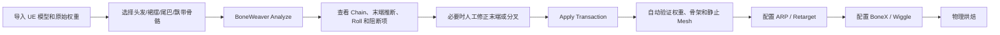
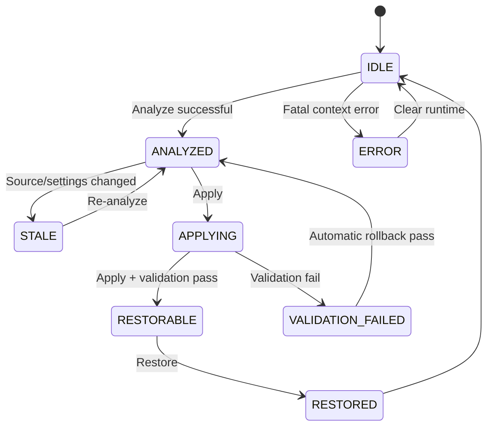

# BoneWeaver v3
## Blender 插件项目 Spec 与 Codex Goal Mode 总执行提示词

> 本文件既是产品规格，也是交给 Codex Goal Mode 的唯一总任务书。  
> 实现过程中，本文档中的明确约束优先于调研材料、旧版实现说明和代码中的临时注释。

---

## 0. 文档元数据

| 字段 | 值 |
|---|---|
| 项目名称 | BoneWeaver |
| 包标识 | `boneweaver` |
| 内部命名空间 | `boneweaver` |
| 项目类型 | Blender Extension / Add-on |
| 文档版本 | `3.0.0` |
| 计划中的插件版本 | `0.1.0`（首个实现版本；数据接口 Schema 为 3.x） |
| 目标 Blender | 4.2+；重点验证用户实际使用的 5.1 / 5.2 环境 |
| UI | 简体中文与英文；内部标识符只使用英文 |
| 核心用途 | 从 Unreal 风格 Joint Hierarchy 构建隐式物理节点图，再无损投影为 BoneX、Wiggle 2 及兼容分支可使用的 Blender 连续骨骼链 |
| 实现层级 | 仅在 Blender 应用层操作 Armature、EditBone、Mesh、Vertex Group |
| MVP 安全模式 | `REST_ONLY_STRICT`；仅转换静止骨架，不重定向既有动画 |
| 外部 Python 依赖 | 禁止；只允许 Blender 内置 Python、`bpy`、`mathutils` 与标准库 |
| 参考实现模型 | Kawaii Physics 的 Joint/Particle Graph、Virtual Tip、Swing Rotation 思路；只参考行为，不移植其运行时求解器 |

---


## 0.1 v3 相对 v2 的核心修订

本版本在原有“直接修改原 deform bones、保留权重、拒绝生产代理链”的基础上，引入了从 Kawaii Physics 源码总结出的更准确抽象：

```text
UE Reference Skeleton Joint Graph
        ↓
BONEWEAVER Immutable Physics Graph
        ↓
Blender EditBone Geometry Projection
```

关键变化：

1. **Bone Tail 不再被视为输入真值。** 物理段首先由父子 Joint Head 位置定义，再投影到 Blender 的 `EditBone.tail`。
2. **新增 Virtual Tip Node。** 叶子骨不直接“猜一根 Blender Bone”，而是先求一个不参与蒙皮的虚拟末端节点，再把该位置投影为真实叶骨的 tail。
3. **新增 Imported Forward Axis 候选。** 参考 Kawaii Physics 的 `BoneForwardAxis + DummyBoneLength`，从导入 Rest Rotation 的 `±X/±Y/±Z` 生成末端候选，并与权重点云、父链切线共同评分。
4. **默认 Roll 改为 `MINIMAL_TWIST`。** 优先保留导入骨骼的原始 Twist，仅对局部主轴进行必要的 Swing；`PARALLEL_TRANSPORT` 改为显式高级模式。
5. **新增候选评分与歧义间隔。** 不再用固定的“权重点云优先于父链”硬编码顺序处理所有模型。
6. **新增长段采样诊断。** 参考 Kawaii Physics 的运行时 inter-bone dummy，但本插件只给出虚拟采样提示和预览，不向 deform Armature 插入新 Bone。
7. **新增 Physics Graph 与 Blender Projection 的独立 Schema、测试和验证规则。**

仍然明确禁止：解绑、重绑、Apply Pose as Rest Pose、重算权重、生产代理链和第三方约束桥接。

---

# 1. 给 Codex 的总指令

你是本项目的主实现工程师。请把本文件视为不可随意弱化的实现合同，并在一个连续 Goal Mode 工作流中完成调查、编码、测试、修正、打包和最终复审。

不要只制作概念验证脚本。最终结果必须是一套：

- 可安装；
- 可卸载；
- 可撤销；
- 可恢复；
- 有明确接口契约；
- 有自动化测试；
- 有诊断报告；
- 不破坏原始顶点权重；
- 能在真实 Blender 文件中安全运行；

的 Blender Extension。

除非遇到无法从仓库、Blender 运行时或本文档判断的真实阻断，不要反复向用户询问。应优先：

1. 检查仓库；
2. 检查 Blender Python API；
3. 建立最小程序化 Fixture；
4. 运行验证；
5. 依据实际结果修正实现。

## 1.1 信息优先级

出现冲突时，按以下顺序处理：

1. 本文件的“不可破坏合同”和接口 Schema；
2. 仓库中的 `CODEX.md`、`AGENTS.md`、项目约定；
3. 当前 Blender 运行时可验证的 API 行为；
4. Blender 官方源码或官方 Python API；
5. 项目已有自动化测试；
6. 外部调研资料；
7. 推测。

外部调研中提出的以下做法已明确否决，不得实现：

```text
删除或临时清空 Armature Modifier
Clear Parent 后重新 Parent
重新执行 With Empty Groups
调用 Apply Pose as Rest Pose
调用 bpy.ops.pose.armature_apply
创建生产代理骨骼链
通过 Copy Transforms / Copy Rotation 桥接代理链
重新计算或转移原始顶点权重
以全局 +Z 作为所有链的默认 Roll
把加权质心当作唯一末端方向
把加权平均距离当作默认末端长度
```

## 1.2 命令环境

用户环境为 Windows。所有项目命令优先使用 PowerShell 7：

```pwsh
pwsh -NoLogo -NoProfile -Command "..."
```

禁止默认使用 Windows PowerShell 5。

调用 Blender 时使用显式路径或可配置环境变量：

```pwsh
$env:BLENDER_EXE = "C:\Program Files\Blender Foundation\Blender 5.2\blender.exe"

& $env:BLENDER_EXE `
  --background `
  --factory-startup `
  --python tests/run_blender_tests.py `
  -- --verbose
```

不得假定 `blender.exe` 一定存在于 `PATH`。

## 1.3 Git 工作规则

开始前必须执行并记录：

```pwsh
git status --short
git branch --show-current
git diff --stat
git diff
```

规则：

- 不丢弃用户已有修改；
- 不执行 `git reset --hard`；
- 不执行无确认的 `git clean -fd`;
- 不把无关脏文件混入本任务；
- 若工作树已有修改，按功能边界隔离本项目改动；
- 不自动提交或推送，除非用户明确要求；
- 不通过删除测试、降低阈值、添加无理由 `skip` 来获得绿色结果；
- 任何自动生成的缓存、构建包和测试产物必须有明确目录与 `.gitignore` 规则。

## 1.4 可使用的并行审查角色

如 Goal Mode 支持子任务或子代理，可并行安排：

- **Contract Guardian**：只读检查接口 Schema、枚举、错误码和版本兼容；
- **Math Solver Reviewer**：只读检查权重点云、特征分解、方向融合、长度分位数和 Roll；
- **Blender Transaction Reviewer**：只读检查 mode 切换、Undo、Snapshot、回滚和依赖图副作用；
- **Regression Guardian**：持续运行 headless 测试；
- **Final Reviewer**：最后一轮只读复审，不直接修改代码。

主代理负责合并结论，不能让多个代理同时无协调地修改同一文件。

---

# 2. 产品目标

## 2.1 用户问题

从 Unreal Engine 资产导出的骨架通常保留：

```text
Bone Name
Parent Index
Joint Translation
Joint Rotation
Vertex Weights
```

但 Unreal 的骨骼更接近具有层级关系的 Joint Transform，而 Blender 的 EditBone 必须具备：

```text
head
tail
roll
parent
use_connect
```

因此导入器通常只能为每个 Joint 人为生成一根固定长度、沿某个局部轴指向的 Blender Bone。结果是：

- 父子层级正确；
- 骨名正确；
- 权重正确；
- 关节位置通常正确；
- 但 tail 朝向和长度不代表真实骨段；
- Roll 不适合物理限制；
- 链节之间视觉和几何上不连续。

BoneX、Wiggle 2、Jiggle Physics 及其兼容分支会依赖：

- Bone head；
- Bone tail；
- Bone length；
- Bone local Y；
- 由 Roll 决定的 local X/Z；
- Parent/Child；
- `use_connect`；
- 标准骨骼链传播。

本插件必须把“Joint hierarchy”重新解释为适合 Blender 物理插件的“Bone segments”，同时保留原模型蒙皮语义。

## 2.2 最终产品行为

对于一条线性层级：

```text
B0 -> B1 -> B2 -> B3
```

转换后应满足：

```text
B0.tail == B1.head
B1.tail == B2.head
B2.tail == B3.head
B3.tail == 通过可靠方法推断的末端位置
```

同时保持：

```text
B0/B1/B2/B3 名称不变
父子关系不变
所有 head 不变
所有 Vertex Group 名称不变
逐顶点权重不变
Mesh 顶点不变
Armature Modifier 不变
```

## 2.3 核心用户流程



必须把 BoneWeaver 放在 ARP、BoneX、Wiggle 生成控制关系之前。

---


## 2.4 Kawaii Physics 调研后的物理真值模型

Kawaii Physics 证明，UE 中的次级物理并不需要真实存在的“Bone Tail”。运行时求解器可把每个骨骼原点视为一个粒子节点：

```text
P0 = Root Joint Origin
P1 = Child Joint Origin
P2 = Grandchild Joint Origin
```

物理段是隐式边：

```text
E0 = P0 → P1
E1 = P1 → P2
```

段长来自父子 Reference Pose 关节位置之差，而不是编辑器里绘制的骨骼长度。根节点作为 Kinematic Anchor，后续节点进行位置积分；模拟后再比较原 Pose 段向量与模拟段向量，求 Swing Quaternion 写回父骨旋转。

本插件不实现这套运行时求解器，但必须采用相同的**数据真值顺序**：

```text
Bone Head / Joint Origin + Parent Hierarchy
    是输入真值

Current Imported Tail
    仅是导入器为 Blender 数据合法性生成的显示几何
    不是物理真值
```

## 2.5 三层架构

### 第一层：Source Joint Graph

来源于当前 Blender Armature 的稳定语义：

```text
Bone Name
Parent Name
Child Names
EditBone Head
Original Rest Rotation / Local Axes
Vertex Group Weight Evidence
```

### 第二层：Immutable Physics Graph

内部建立：

```text
PhysicsNode
PhysicsEdge
PhysicsChain
VirtualTipNode
```

规则：

- 每个真实 Bone 对应一个 `REAL_BONE` PhysicsNode；
- Node Position 等于 Bone Head；
- Parent→Child 产生 `HIERARCHY_SEGMENT`；
- 叶子 Bone 可产生一个 `VIRTUAL_TIP` Node；
- Virtual Tip 不对应真实 Bone、不对应 Vertex Group、不参与蒙皮；
- Root Node 为 Kinematic；
- 分叉可存在于图中，但不能自动投影成一根具有唯一方向的 Blender parent tail。

### 第三层：Blender Geometry Projection

只在 Physics Graph 通过验证后执行：

```text
Hierarchy Edge(parent, child)
    → parent_edit_bone.tail = child_node.position

Virtual Tip Edge(leaf, virtual_tip)
    → leaf_edit_bone.tail = virtual_tip.position
```

`use_connect` 与 Roll 属于 Blender/目标物理插件的投影配置，不是 Source Joint Graph 的固有属性。

## 2.6 项目边界

当前项目继续以 BoneX/Wiggle 适配为目的，因此必须把隐式 Joint Graph 显式投影成 Blender Bone Geometry。

未来可以另立项目实现“Kawaii-style Blender Runtime Solver”，直接使用 PoseBone Head 和父子 Head 距离进行模拟，从而完全不修改 Rest Pose；但该工作包括实时求解、碰撞、子步进、缓存、渲染乱序与烘焙，不属于本项目 MVP。

---

# 3. 不可破坏合同

## 3.1 默认生产架构

唯一默认生产方案：

> 直接在原始 Armature 上修改所选原 Bone 的 EditBone 几何表示，使同一批原始 deform bones 形成物理链。

不得创建参与生产求值的第二套代理骨架。

## 3.2 允许修改

MVP 只允许修改目标 Bone 的：

```text
EditBone.tail
EditBone.roll
EditBone.use_connect
```

可选地创建：

```text
只读运行时 ConversionPlan
持久化 Snapshot Text datablock
只读 Viewport Preview draw handler
可选 Bone Collection 角色标记
```

若启用角色集合，只允许创建：

```text
BONEWEAVER_Anchors
BONEWEAVER_Dynamics
BONEWEAVER_BranchBoundaries
BONEWEAVER_LowConfidence
```

角色集合默认关闭，不得影响 Deform。

## 3.3 禁止修改

MVP 禁止修改：

```text
Bone.name
Bone.parent
EditBone.head
Bone.use_deform
Bone.inherit_scale
Bone.use_inherit_rotation
Bone.use_local_location
Bone.use_relative_parent
Mesh vertex coordinates
Mesh topology
Vertex Group names
Vertex Group membership
Vertex weights
Mesh.parent
matrix_parent_inverse
Armature Modifier existence
Armature Modifier order
Armature Modifier target
Armature Modifier options
Armature Object transform
Mesh Object transform
Existing constraints
Existing drivers
Existing actions
Existing NLA tracks
Shape Keys
Material
Morph targets
Importer-specific orig_loc/orig_quat/post_quat
```

## 3.4 明确禁止的 API 路径

代码库中不得出现用于转换流程的以下调用：

```python
bpy.ops.pose.armature_apply(...)
bpy.ops.object.parent_set(...)
bpy.ops.object.parent_clear(...)
bpy.ops.armature.calculate_roll(...)
mesh.modifiers.remove(armature_modifier)
mesh.modifiers.new(..., 'ARMATURE')
```

允许使用 `bpy.ops.object.mode_set`，但必须通过上下文守卫，且所有实际 Bone 修改使用 Blender Data API。

## 3.5 静止蒙皮不变量

转换前后，相关 Mesh 的静止 evaluated world-space 位置必须保持不变。

对骨骼 \(i\)：

\[
D_i=P_iR_i^{-1}
\]

中性姿态时：

\[
P_i=R_i
\Rightarrow D_i=I
\]

修改 Rest Matrix 后，只要仍处于新的中性姿态：

\[
P_i'=R_i'
\Rightarrow D_i'=I
\]

因此本插件不需要解绑和重绑；它需要的是：

- 整体 Pose 为单位状态；
- 无动画、Constraint、Driver 干扰；
- 修改后强制验证；
- 验证失败自动回滚。

## 3.6 动画边界

保留顶点权重不等于保留旧动画。

MVP 必须阻断：

- Armature Active Action；
- Armature NLA；
- Armature Driver；
- 相关 Bone FCurve；
- 非单位 Pose；
- 相关 Constraint；
- BoneX/ARP 已生成控制关系。

MVP 不更新 UEFormat 或其他导入器保存的：

```text
orig_loc
orig_quat
post_quat
```

转换后若继续直接把 UE 动画导入同一 Armature，动画 Basis 可能不再匹配。UI 和文档必须明确说明：

> v0.1.0 是 Physics Preparation 工具，不是 UE 动画 Basis 重定向工具。

---

# 4. 功能范围

## 4.1 MVP 必须实现

- 活动 Armature 解析；
- 目标 Bone Scope 解析；
- 关联 Mesh 搜索；
- Strict Preflight；
- Source Joint Graph；
- Immutable Physics Graph；
- 最大线性链分解；
- 分叉识别；
- 外部 Connected Child 识别；
- Root Kinematic / Anchor 角色；
- Interior hierarchy edge 投影；
- Virtual Tip Node；
- Imported Forward Axis 候选；
- Weight PCA / Centroid / Parent Tangent 候选；
- Terminal Candidate Scoring；
- 候选歧义间隔与低置信度阻断；
- Roll Minimal Twist；
- 可选 Parallel Transport；
- 裙摆 Radial Roll；
- BoneX/Wiggle Profile；
- 长段虚拟采样诊断；
- 不可变 ConversionPlan；
- Viewport Preview；
- Apply 事务；
- Undo；
- Snapshot；
- 自动回滚；
- Restore；
- 权重摘要；
- 骨架摘要；
- Modifier 摘要；
- Physics Graph / Blender Projection 一致性验证；
- 静止 evaluated mesh 对比；
- 诊断 JSON 导出；
- 自动化 Headless 测试；
- 可安装 ZIP 包。

## 4.2 MVP 非目标

- 自动修改 CUE4Parse/FModel/UModel；
- 在 Blender 中移植 Kawaii Physics 运行时求解器；
- 自动识别所有 UE 游戏骨骼命名规则；
- 自动重定向 UE 动画；
- 自动保留 ARP 控制器语义；
- 自动保留 BoneX 现有刚体；
- 自动配置第三方插件私有 RNA；
- 自动跨越零位移 Helper；
- 自动重设 Parent；
- 自动合并多条裙摆链；
- 自动决定复杂分叉的主方向；
- 自动重新权重；
- 自动创建持久碰撞体；
- 自动向 deform Armature 插入用于采样的 Dummy Bone；
- 自动烘焙物理。

---

# 5. Blender Extension 结构

必须使用清晰的分层结构。建议如下：

```text
boneweaver/
├─ __init__.py
├─ blender_manifest.toml
├─ registration.py
├─ contracts.py
├─ constants.py
├─ compatibility.py
├─ properties.py
├─ translations.py
├─ core/
│  ├─ models.py
│  ├─ canonical.py
│  ├─ context_guard.py
│  ├─ armature_reader.py
│  ├─ armature_graph.py
│  ├─ physics_graph.py
│  ├─ graph_projection.py
│  ├─ mesh_resolver.py
│  ├─ modifier_audit.py
│  ├─ animation_audit.py
│  ├─ weight_cloud.py
│  ├─ eigen3.py
│  ├─ terminal_candidates.py
│  ├─ terminal_solver.py
│  ├─ swing_math.py
│  ├─ segment_sampling.py
│  ├─ roll_solver.py
│  ├─ profile_rules.py
│  ├─ planner.py
│  ├─ fingerprint.py
│  ├─ snapshot.py
│  ├─ apply_transaction.py
│  ├─ restore.py
│  ├─ validation.py
│  └─ serialization.py
├─ operators/
│  ├─ analyze.py
│  ├─ apply.py
│  ├─ validate.py
│  ├─ preview.py
│  ├─ restore.py
│  ├─ export_report.py
│  └─ clear_runtime.py
├─ ui/
│  ├─ panel.py
│  ├─ lists.py
│  ├─ draw.py
│  └─ messages.py
├─ schemas/
│  ├─ settings.schema.json
│  ├─ conversion-plan.schema.json
│  ├─ snapshot.schema.json
│  └─ diagnostic-report.schema.json
├─ tests/
│  ├─ run_blender_tests.py
│  ├─ fixture_builders.py
│  ├─ assertions.py
│  ├─ test_registration.py
│  ├─ test_contracts.py
│  ├─ test_graph.py
│  ├─ test_physics_graph.py
│  ├─ test_graph_projection.py
│  ├─ test_mesh_resolver.py
│  ├─ test_weight_cloud.py
│  ├─ test_eigen3.py
│  ├─ test_terminal_candidates.py
│  ├─ test_terminal_solver.py
│  ├─ test_swing_math.py
│  ├─ test_segment_sampling.py
│  ├─ test_roll_solver.py
│  ├─ test_preflight.py
│  ├─ test_plan_determinism.py
│  ├─ test_apply_transaction.py
│  ├─ test_validation.py
│  ├─ test_restore.py
│  └─ test_schema_roundtrip.py
├─ docs/
│  ├─ architecture.md
│  ├─ algorithms.md
│  ├─ safety.md
│  ├─ compatibility.md
│  └─ manual-test-bonex-wiggle.md
├─ README.md
├─ README_zh.md
└─ CHANGELOG.md
```

不得把所有逻辑堆在一个 `__init__.py`。

## 5.1 Manifest 基线

若仓库已有 License 约定，必须沿用。若是全新内部项目且没有 License 决策，可先使用以下 manifest，并在最终报告标记 License 需要用户确认：

```toml
schema_version = "1.0.0"

id = "boneweaver"
version = "0.1.0"
name = "BoneWeaver"
tagline = "Convert imported Unreal-style joints into physics-ready Blender bone chains"
maintainer = "Project Maintainer"
type = "add-on"

blender_version_min = "4.2.0"

license = [
  "SPDX:GPL-3.0-or-later",
]
```

不得把第三方 BoneX、Wiggle 或 ARP 代码复制到本项目。

允许只读研究 Kawaii Physics 的公开 MIT 源码，以理解以下行为：

```text
RootBone descendant collection
Parent/Child particle graph
reference-pose joint distance
virtual terminal dummy
configurable forward axis
Verlet position integration
length restoration
pose-vector → simulated-vector swing rotation
```

不得直接逐行翻译其 C++ 求解器，也不得把 Kawaii Physics 运行时模块作为本插件依赖。本项目仍是 Blender 骨架转换器，不是 Kawaii Physics 的移植版。

---

# 6. 稳定接口契约

所有公开标识符统一定义在 `contracts.py`。禁止在多个文件中重复硬编码枚举字符串、Operator ID、Schema ID、算法版本或错误码。

## 6.1 稳定枚举

### `ScopeMode`

```text
SELECTED_BONES
SELECTED_ROOTS_AND_DESCENDANTS
ACTIVE_BONE_COLLECTION
```

### `MeshScope`

```text
ACTIVE_ASSOCIATED_MESH
CHECKED_ASSOCIATED_MESHES
ALL_ASSOCIATED_MESHES
```

### `PhysicsProfile`

```text
BONEX_ROTATION_CHAIN
BONEX_TRANSLATION_ALLOWED
WIGGLE2_ROTATION_CHAIN
WIGGLE2_STRETCH_CHAIN
GEOMETRY_ONLY
```

### `TerminalMode`

```text
AUTO_HYBRID
UNIQUE_CHILD_ONLY
IMPORTED_FORWARD_AXIS_ONLY
WEIGHT_CLOUD_ONLY
PARENT_EXTRAPOLATION_ONLY
ORIGINAL_AXIS_ONLY
MANUAL_ONLY
```

`AUTO_HYBRID` 在 Schema 3.x 中表示“生成多个候选并评分”，不是固定的简单 fallback 链。

### `TerminalSource`

```text
MANUAL_OVERRIDE
UNIQUE_DIRECT_CHILD_HEAD
IMPORTED_FORWARD_AXIS_DUMMY
WEIGHT_CLOUD_LINEAR
WEIGHT_CLOUD_PLANAR_BLEND
PARENT_CHAIN_EXTRAPOLATION
ORIGINAL_LOCAL_Y
HYBRID_CANDIDATE_SCORE
UNRESOLVED
```

### `TerminalCandidateKind`

```text
MANUAL
DIRECT_CHILD
IMPORTED_AXIS
WEIGHT_PRINCIPAL_AXIS
WEIGHT_CENTROID
WEIGHT_PLANAR_BLEND
PARENT_TANGENT
ORIGINAL_DISPLAY_AXIS
```

### `BoneForwardAxis`

```text
AUTO
X_POSITIVE
X_NEGATIVE
Y_POSITIVE
Y_NEGATIVE
Z_POSITIVE
Z_NEGATIVE
```

这些轴来自**修改前的 Bone Rest Matrix**，不是 Blender 修改后的新局部轴。

### `TipLengthMode`

```text
AUTO_EVIDENCE
WEIGHT_PERCENTILE
PREVIOUS_SEGMENT
CHAIN_MEDIAN
ABSOLUTE
```

### `PhysicsNodeKind`

```text
REAL_BONE
VIRTUAL_TIP
```

### `PhysicsEdgeKind`

```text
HIERARCHY_SEGMENT
VIRTUAL_TIP_SEGMENT
```

### `RollMode`

```text
MINIMAL_TWIST
PARALLEL_TRANSPORT
RADIAL_REFERENCE
KEEP_NUMERIC_ROLL
```

默认必须是 `MINIMAL_TWIST`。

`KEEP_NUMERIC_ROLL` 只作为诊断/实验模式。tail 改变后，即使 roll 数值不变，局部 X/Z 也会变化。

### `RadialReferenceMode`

```text
ARMATURE_ORIGIN
CURSOR
OBJECT
BONE_HEAD
```

### `ExclusivityMode`

```text
NONE
CHAIN_NORMALIZED
SELECTED_SET_NORMALIZED
```

### `PlanState`

```text
IDLE
ANALYZED
STALE
APPLYING
APPLIED
VALIDATION_FAILED
RESTORABLE
RESTORED
ERROR
```

### `IssueSeverity`

```text
INFO
WARNING
BLOCKER
```

### `OverrideMode`

```text
NONE
CURSOR_POSITION
REFERENCE_OBJECT
EXPLICIT_DIRECTION_LENGTH
MESH_VERTEX
```

## 6.2 Schema 版本规则

每个 JSON 负载必须包含：

```json
{
  "kind": "boneweaver.conversion_plan",
  "schema_version": "3.0.0",
  "algorithm_version": "boneweaver-physics-graph-v1"
}
```

规则：

- Major 不一致：拒绝读取；
- 相同 Major、较新 Minor：允许忽略未知可选字段，但必须验证 Required 字段；
- Patch 变化：完全兼容；
- 修改稳定字段名称或语义时升级 Major；
- 新增可选字段升级 Minor；
- 修复实现且不改变数据合同升级 Patch；
- `algorithm_version` 变化会使旧 Plan Stale，即使 JSON Schema 兼容；
- `plan_id` 必须纳入 `algorithm_version`。

---

# 7. Blender RNA 接口 Schema

## 7.1 Scene 设置

注册：

```python
bpy.types.Scene.boneweaver_settings: PointerProperty(type=BONEWEAVER_PG_Settings)
```

### `BONEWEAVER_PG_Settings`

| 属性 | RNA 类型 | 默认值 | 范围/约束 | 说明 |
|---|---|---:|---|---|
| `scope_mode` | Enum | `SELECTED_BONES` | `ScopeMode` | 目标 Bone 范围 |
| `mesh_scope` | Enum | `ALL_ASSOCIATED_MESHES` | `MeshScope` | 权重分析 Mesh 范围 |
| `physics_profile` | Enum | `BONEX_ROTATION_CHAIN` | `PhysicsProfile` | Blender 投影连接规则 |
| `terminal_mode` | Enum | `AUTO_HYBRID` | `TerminalMode` | Virtual Tip 求解模式 |
| `bone_forward_axis` | Enum | `AUTO` | `BoneForwardAxis` | Imported Axis 候选或强制轴 |
| `tip_length_mode` | Enum | `AUTO_EVIDENCE` | `TipLengthMode` | Virtual Tip 长度模式 |
| `absolute_tip_length` | Float | `0.0` | `[0, inf)` | `ABSOLUTE` 模式；0 为无效 |
| `roll_mode` | Enum | `MINIMAL_TWIST` | `RollMode` | 默认保留原 Twist |
| `radial_reference_mode` | Enum | `ARMATURE_ORIGIN` | `RadialReferenceMode` | 裙摆参考 |
| `radial_reference_object` | Pointer Object | `None` | Object | 可选参考对象 |
| `radial_reference_bone` | String | `""` | Bone Name | 可选参考 Bone |
| `minimum_weight` | Float | `0.02` | `[0.0, 1.0]` | 去除极弱权重噪点 |
| `weight_exponent` | Float | `2.0` | `[0.25, 8.0]` | 强化高权重点 |
| `use_vertex_area_weight` | Bool | `True` |  | 降低高密度拓扑偏置 |
| `exclusivity_mode` | Enum | `CHAIN_NORMALIZED` | `ExclusivityMode` | 降低 Parent/Leaf 共享区影响 |
| `terminal_percentile` | Float | `0.90` | `[0.50, 0.999]` | 沿候选轴长度分位数 |
| `minimum_candidate_score` | Float | `0.62` | `[0, 1]` | 自动选中最低评分 |
| `candidate_minimum_margin` | Float | `0.08` | `[0, 1]` | 第一、第二候选最低分差 |
| `minimum_confidence` | Float | `0.70` | `[0, 1]` | 自动应用最低置信度 |
| `medium_confidence` | Float | `0.50` | `[0, 1]` | UI 警告阈值 |
| `minimum_length_ratio` | Float | `0.25` | `[0.01, 2.0]` | 相对参考链节 |
| `maximum_length_ratio` | Float | `2.00` | `[0.1, 10.0]` | 相对参考链节 |
| `maximum_auto_bend_degrees` | Float | `115.0` | `[0, 180]` | 候选方向与父链冲突限制 |
| `parallel_transport_weight` | Float | `0.65` | `[0, 1]` | 仅 Parallel Transport 使用 |
| `old_axis_weight` | Float | `0.35` | `[0, 1]` | 仅 Parallel Transport 使用 |
| `enable_segment_sampling_hints` | Bool | `True` |  | 长段诊断，不改骨架 |
| `long_segment_ratio_warning` | Float | `2.5` | `[1, 20]` | 相对链中位长度 |
| `virtual_preview_subdivision_max` | Int | `8` | `[0, 50]` | Preview 虚拟采样上限 |
| `strict_whole_armature_pose` | Bool | `True` |  | MVP 要求全骨架中性 Pose |
| `validate_full_mesh` | Bool | `True` |  | 对全部关联 Mesh 比较 |
| `create_role_collections` | Bool | `False` |  | 可选角色集合 |
| `preview_show_joint_graph` | Bool | `True` |  | Physics Graph Preview |
| `preview_show_virtual_tips` | Bool | `True` |  | Virtual Tip Preview |
| `preview_show_candidate_axes` | Bool | `True` |  | 候选方向 Preview |
| `preview_show_old_axes` | Bool | `True` |  | 原 Rest Axis |
| `preview_show_new_axes` | Bool | `True` |  | 投影后 Axis |
| `preview_show_weight_centroid` | Bool | `True` |  | 权重证据 |
| `preview_axis_scale` | Float | `0.1` | `(0, inf)` | 相对场景尺度 |
| `position_epsilon_factor` | Float | `1e-7` | `[1e-10, 1e-3]` | 相对模型尺度 |
| `last_export_directory` | String DIR_PATH | `""` |  | 不参与 Plan |

约束：

```text
medium_confidence <= minimum_confidence
minimum_length_ratio <= maximum_length_ratio
parallel_transport_weight + old_axis_weight > 0
bone_forward_axis != AUTO when terminal_mode == IMPORTED_FORWARD_AXIS_ONLY
absolute_tip_length > 0 when tip_length_mode == ABSOLUTE
```

候选评分各组成项的权重不作为 v0.1.0 普通 UI 设置，统一定义在版本化 `CandidateScoringProfile` 中，避免用户配置空间过大以及 Plan 不可复现。

建议内置 Profile：

```text
mesh_support             0.40
chain_continuity         0.25
cloud_shape_suitability  0.15
imported_axis_prior       0.10
length_plausibility       0.10
```

这些值必须写入 Plan 的 `scoring_profile`，改变时升级 `algorithm_version`。

---

## 7.2 末端覆盖项

### `BONEWEAVER_PG_TerminalOverride`

| 属性 | 类型 | 说明 |
|---|---|---|
| `bone_name` | String | 稳定 Bone 名称 |
| `mode` | Enum `OverrideMode` | 覆盖方式 |
| `reference_object` | Pointer Object | `REFERENCE_OBJECT` |
| `direction` | FloatVector size=3 | Armature Local 方向 |
| `length` | Float | 正数 |
| `mesh_object_name` | String | 顶点来源 Mesh |
| `vertex_index` | Int | 顶点索引 |
| `enabled` | Bool | 是否生效 |

注册为：

```python
BONEWEAVER_PG_Settings.terminal_overrides: CollectionProperty(
    type=BONEWEAVER_PG_TerminalOverride
)
```

覆盖项只影响 Analyze，不在 Apply 中临时重新读取对象位置。Analyze 必须把最终 Armature Local 坐标冻结到 Plan。

## 7.3 运行时状态

注册：

```python
bpy.types.WindowManager.boneweaver_runtime: PointerProperty(
    type=BONEWEAVER_PG_Runtime
)
```

### `BONEWEAVER_PG_Runtime`

| 属性 | 类型 | 说明 |
|---|---|---|
| `state` | Enum `PlanState` | 状态机 |
| `plan_id` | String | 当前 Plan ID |
| `plan_fingerprint` | String | 源状态摘要 |
| `plan_summary` | String | UI 摘要 |
| `snapshot_id` | String | 最近 Snapshot |
| `snapshot_text_name` | String | 持久化 Text |
| `issue_count_info` | Int | 统计 |
| `issue_count_warning` | Int | 统计 |
| `issue_count_blocker` | Int | 统计 |
| `active_chain_index` | Int | UIList |
| `active_proposal_index` | Int | UIList |
| `preview_enabled` | Bool | Draw Handler 状态镜像 |
| `last_error` | String | 最近错误 |
| `generation` | Int | 每次 Analyze 增加 |
| `is_busy` | Bool | 防止重入 |

实际不可变 Plan 不保存在 RNA Collection 中，而保存在模块级 Runtime Store：

```python
_PLAN_STORE: dict[str, ConversionPlan]
```

WindowManager 只保留 ID 和 UI 摘要。

文件重新打开后 Runtime Store 为空，状态必须回到 `IDLE`，要求重新 Analyze。

## 7.4 UI 摘要项

可以创建：

```text
BONEWEAVER_PG_ChainItem
BONEWEAVER_PG_BoneProposalItem
BONEWEAVER_PG_IssueItem
```

这些只用于 UI 展示，不作为 Apply 的数据源。Apply 必须从 `_PLAN_STORE[plan_id]` 读取不可变 Plan。

---

# 8. Operator 接口 Schema

## 8.1 `boneweaver.analyze`

```python
bl_idname = "boneweaver.analyze"
bl_label = "Analyze UE Bone Chains"
bl_options = {"REGISTER"}
```

### Poll

- 有活动对象；
- 活动对象可解析为 Armature；
- 不处于 Busy；
- 当前文件不是正在 Render 的不可安全状态。

### 输入

只读取：

```text
Scene.boneweaver_settings
当前选择
活动 Armature
关联 Mesh
```

### 输出

- 创建不可变 `ConversionPlan`；
- 写入 `_PLAN_STORE`；
- 更新 WindowManager Runtime；
- 不创建 Text；
- 不改 Armature；
- 不改 Mesh；
- 不创建 Object、Constraint、Driver；
- 返回 `FINISHED`，即使存在 Blocker，因为 Analyze 本身成功；
- 若连基本上下文都不能读取，返回 `CANCELLED`。

## 8.2 `boneweaver.apply`

```python
bl_idname = "boneweaver.apply"
bl_label = "Apply Chain Conversion"
bl_options = {"REGISTER", "UNDO"}
```

### Operator Property

```python
plan_id: StringProperty(options={"HIDDEN"})
```

### Poll

- Runtime `state == ANALYZED`；
- 当前 Plan 存在；
- `issue_count_blocker == 0`；
- 不处于 Busy。

### Execute

必须：

1. 确认 `plan_id` 与 Runtime 一致；
2. 重算 source fingerprint；
3. 不一致则把状态设为 `STALE` 并取消；
4. 捕获 Baseline；
5. 建立内存 Snapshot；
6. 建立持久化 Snapshot Text；
7. 执行事务；
8. 运行 Post Validation；
9. 失败自动恢复；
10. 成功状态为 `APPLIED/RESTORABLE`。

不得读取当前 UI 设置重新计算 Proposal。

## 8.3 `boneweaver.validate`

```python
bl_idname = "boneweaver.validate"
bl_label = "Validate Current Conversion"
bl_options = {"REGISTER"}
```

Operator Property：

```text
validation_scope:
    CURRENT_PLAN
    LAST_SNAPSHOT
```

不修改场景。生成 `DiagnosticReport`。

## 8.4 `boneweaver.preview_toggle`

```python
bl_idname = "boneweaver.preview_toggle"
bl_label = "Toggle Chain Preview"
```

- 只添加或移除 GPU draw handler；
- 不创建 Empty；
- 不创建 Curve；
- 不创建 Mesh；
- 不修改 Armature；
- 文件关闭、Add-on 禁用或 Plan Stale 时必须移除 handler。

## 8.5 `boneweaver.restore_snapshot`

```python
bl_idname = "boneweaver.restore_snapshot"
bl_label = "Restore BONEWEAVER Snapshot"
bl_options = {"REGISTER", "UNDO"}
```

Properties：

```text
snapshot_text_name: String
allow_partial: Bool = False
```

默认只允许完整无冲突恢复。

## 8.6 `boneweaver.export_report`

```python
bl_idname = "boneweaver.export_report"
bl_label = "Export BONEWEAVER Diagnostic Report"
```

继承 `ExportHelper`，输出 UTF-8 JSON。

Properties：

```text
filepath
include_plan = True
include_weight_stats = True
include_snapshot_summary = True
```

不得默认导出逐顶点坐标或完整权重表，避免报告过大。只导出 digest 与统计。

## 8.7 `boneweaver.clear_runtime`

- 清除 Plan Store 当前 Plan；
- 关闭 Preview；
- 重置 Runtime；
- 不删除 Snapshot Text；
- 不修改场景骨架。

---

# 9. UI Schema

面板：

```python
bl_space_type = "VIEW_3D"
bl_region_type = "UI"
bl_category = "BoneWeaver"
```

面板分区：

```text
1. Context
2. Scope
3. Physics Profile
4. Terminal Inference
5. Roll
6. Analysis
7. Issues
8. Apply / Validate / Restore
9. Diagnostics
```

## 9.1 Context 区

显示：

```text
Active Armature
Current Mode
Selected Bone Count
Associated Mesh Count
Armature Object Scale
Active Action
NLA Count
Constraint Count
Driver Count
Plan State
```

## 9.2 Analysis 表

Bone Proposal 每行显示：

```text
Bone
Role
Old Length
New Length
Terminal Source
Selected Candidate
Candidate Margin
Cloud Shape
Confidence
Final Connected
Roll Mode
Issue Count
```

Chain 每行显示：

```text
Root
Leaf
Physics Node Count
Real Bone Count
Virtual Tip
Profile
Branch Boundary
Resolved
```

## 9.3 操作使能规则

`Apply` 仅在：

```text
Plan exists
Plan state == ANALYZED
Blocker count == 0
Fingerprint current
Not busy
```

时可用。

`Restore` 仅在：

```text
Snapshot Text exists
Active Armature matches structural fingerprint
No restore conflict
```

时可用。

---

# 10. 内部不可变数据模型

使用 `@dataclass(frozen=True, slots=True)`。任何 Apply 数据必须来自这些不可变对象，不得直接从 UIList 或当前选择重新推断。

## 10.1 `BoneState`

```python
@dataclass(frozen=True, slots=True)
class BoneState:
    name: str
    parent_name: str | None
    child_names: tuple[str, ...]
    head: tuple[float, float, float]
    tail: tuple[float, float, float]
    roll: float
    matrix_local: tuple[float, ...]
    local_x: tuple[float, float, float]
    local_y: tuple[float, float, float]
    local_z: tuple[float, float, float]
    use_connect: bool
    use_deform: bool
    inherit_scale: str
    use_inherit_rotation: bool
    bbone_segments: int
    is_socket: bool
    importer_metadata_flags: tuple[str, ...]
```

## 10.2 `MeshBindingState`

```python
@dataclass(frozen=True, slots=True)
class MeshBindingState:
    object_name: str
    data_name: str
    vertex_count: int
    polygon_count: int
    armature_modifier_names: tuple[str, ...]
    selected_armature_modifier_name: str
    object_matrix_world: tuple[float, ...]
    mesh_to_armature_matrix: tuple[float, ...]
    vertex_group_names: tuple[str, ...]
    vertex_group_digest: str
    modifier_digest: str
    base_mesh_digest: str
```

## 10.3 `PhysicsNode`

```python
@dataclass(frozen=True, slots=True)
class PhysicsNode:
    node_id: str
    kind: str                     # REAL_BONE / VIRTUAL_TIP
    bone_name: str | None
    joint_position: tuple[float, float, float]
    rest_rotation: tuple[float, float, float, float] | None
    local_x: tuple[float, float, float] | None
    local_y: tuple[float, float, float] | None
    local_z: tuple[float, float, float] | None
    parent_node_id: str | None
    child_node_ids: tuple[str, ...]
    is_kinematic: bool
    source: str
```

规则：

- `REAL_BONE.joint_position == BoneState.head`；
- `VIRTUAL_TIP.bone_name is None`；
- Virtual Tip 不出现在 Armature Bone 名称集合；
- 每个 Virtual Tip 恰有一个真实父节点且无 child；
- 根真实节点默认 `is_kinematic=True`。

## 10.4 `PhysicsEdge`

```python
@dataclass(frozen=True, slots=True)
class PhysicsEdge:
    edge_id: str
    kind: str                     # HIERARCHY_SEGMENT / VIRTUAL_TIP_SEGMENT
    parent_node_id: str
    child_node_id: str
    rest_vector: tuple[float, float, float]
    rest_length: float
    source: str
```

必须满足：

```text
rest_vector = child.position - parent.position
rest_length = |rest_vector|
rest_length > epsilon
```

## 10.5 `PhysicsChain`

```python
@dataclass(frozen=True, slots=True)
class PhysicsChain:
    chain_id: str
    node_ids: tuple[str, ...]
    edge_ids: tuple[str, ...]
    real_bone_names: tuple[str, ...]
    root_node_id: str
    terminal_node_id: str
    has_virtual_tip: bool
    branch_parent_node_id: str | None
    resolved: bool
    issue_codes: tuple[str, ...]
```

## 10.6 `PhysicsGraph`

```python
@dataclass(frozen=True, slots=True)
class PhysicsGraph:
    graph_id: str
    node_ids: tuple[str, ...]
    edge_ids: tuple[str, ...]
    nodes: tuple[PhysicsNode, ...]
    edges: tuple[PhysicsEdge, ...]
    chains: tuple[PhysicsChain, ...]
    issue_codes: tuple[str, ...]
```

`graph_id` 由排序后的节点和边 canonical payload 计算。

## 10.7 `WeightCloudStats`

```python
@dataclass(frozen=True, slots=True)
class WeightCloudStats:
    bone_name: str
    mesh_names: tuple[str, ...]
    sample_count: int
    effective_sample_count: float
    total_statistical_weight: float
    centroid: tuple[float, float, float] | None
    principal_axis: tuple[float, float, float] | None
    eigenvalues: tuple[float, float, float] | None
    linearity: float
    planarity: float
    sphericity: float
    positive_projection_fraction: float
    centroid_distance_ratio: float
    direction_agreement: float
    length_percentile: float | None
    cloud_class: str
    confidence: float
    warnings: tuple[str, ...]
```

`cloud_class`：

```text
LINEAR
PLANAR
ISOTROPIC
INSUFFICIENT
DISCONNECTED_ISLANDS
```

## 10.8 `TerminalCandidateScore`

```python
@dataclass(frozen=True, slots=True)
class TerminalCandidateScore:
    mesh_support: float
    chain_continuity: float
    cloud_shape_suitability: float
    imported_axis_prior: float
    length_plausibility: float
    penalties: float
    total: float
```

## 10.9 `TerminalCandidate`

```python
@dataclass(frozen=True, slots=True)
class TerminalCandidate:
    candidate_id: str
    kind: str
    axis_label: str | None
    direction: tuple[float, float, float]
    raw_length: float
    clamped_length: float
    tail: tuple[float, float, float]
    score: TerminalCandidateScore
    evidence: tuple[str, ...]
    issue_codes: tuple[str, ...]
```

## 10.10 `TerminalSolution`

```python
@dataclass(frozen=True, slots=True)
class TerminalSolution:
    bone_name: str
    source: str
    selected_candidate_id: str | None
    candidates: tuple[TerminalCandidate, ...]
    virtual_tip_node_id: str | None
    tail: tuple[float, float, float]
    direction: tuple[float, float, float]
    length: float
    confidence: float
    score_margin: float
    requires_confirmation: bool
    evidence: tuple[str, ...]
```

## 10.11 `BoneProposal`

```python
@dataclass(frozen=True, slots=True)
class BoneProposal:
    bone_name: str
    chain_id: str
    source_edge_id: str
    role: str
    original_head: tuple[float, float, float]
    original_tail: tuple[float, float, float]
    original_roll: float
    proposed_tail: tuple[float, float, float]
    proposed_roll_reference_z: tuple[float, float, float]
    final_use_connect: bool
    terminal_source: str
    confidence: float
    issue_codes: tuple[str, ...]
```

Role：

```text
ANCHOR
DYNAMIC
LEAF
BRANCH_BOUNDARY
UNRESOLVED
```

## 10.12 `SegmentSamplingHint`

```python
@dataclass(frozen=True, slots=True)
class SegmentSamplingHint:
    edge_id: str
    segment_length: float
    reference_length: float
    length_ratio: float
    suggested_virtual_subdivisions: int
    severity: str
    message_key: str
```

该结构只用于诊断和 Preview，不得产生真实 Bone。

## 10.13 `ValidationIssue`

```python
@dataclass(frozen=True, slots=True)
class ValidationIssue:
    severity: str
    code: str
    message_key: str
    message: str
    bone_names: tuple[str, ...] = ()
    object_names: tuple[str, ...] = ()
    node_ids: tuple[str, ...] = ()
    edge_ids: tuple[str, ...] = ()
    details: tuple[tuple[str, str], ...] = ()
```

Issue 排序必须稳定：

```text
severity rank
code
bone_names
node_ids
edge_ids
object_names
message_key
```

## 10.14 `ConversionPlan`

```python
@dataclass(frozen=True, slots=True)
class ConversionPlan:
    kind: str
    schema_version: str
    algorithm_version: str
    addon_version: str
    plan_id: str
    source_fingerprint: str
    settings_fingerprint: str
    armature_object_name: str
    armature_data_name: str
    profile: str
    scoring_profile: tuple[tuple[str, float], ...]
    mesh_states: tuple[MeshBindingState, ...]
    bone_states: tuple[BoneState, ...]
    physics_graph: PhysicsGraph
    weight_clouds: tuple[WeightCloudStats, ...]
    terminal_solutions: tuple[TerminalSolution, ...]
    proposals: tuple[BoneProposal, ...]
    segment_sampling_hints: tuple[SegmentSamplingHint, ...]
    issues: tuple[ValidationIssue, ...]
```

`plan_id` 必须由不含时间戳与 `plan_id` 自身的 canonical payload 计算。相同输入、设置、Schema 和算法版本必须产生相同 Plan ID。

---

# 11. JSON Schema 合同

Schema 文件必须真实存在于 `schemas/`，并与 Dataclass Serializer 保持一致。测试必须对示例、Plan、Snapshot 和 Diagnostic Report 执行 round-trip。

## 11.1 Conversion Plan 核心 Schema

`schemas/conversion-plan.schema.json` 至少满足：

```json
{
  "$schema": "https://json-schema.org/draft/2020-12/schema",
  "$id": "boneweaver://schema/conversion-plan/3.0.0",
  "title": "BoneWeaver Conversion Plan",
  "type": "object",
  "additionalProperties": false,
  "required": [
    "kind",
    "schema_version",
    "algorithm_version",
    "addon_version",
    "plan_id",
    "source_fingerprint",
    "settings_fingerprint",
    "armature",
    "profile",
    "scoring_profile",
    "meshes",
    "bones",
    "physics_graph",
    "weight_clouds",
    "terminal_solutions",
    "proposals",
    "segment_sampling_hints",
    "issues"
  ],
  "properties": {
    "kind": {"const": "boneweaver.conversion_plan"},
    "schema_version": {
      "type": "string",
      "pattern": "^3\\.[0-9]+\\.[0-9]+$"
    },
    "algorithm_version": {
      "type": "string",
      "minLength": 1
    },
    "addon_version": {"type": "string"},
    "plan_id": {"$ref": "#/$defs/sha256"},
    "source_fingerprint": {"$ref": "#/$defs/sha256"},
    "settings_fingerprint": {"$ref": "#/$defs/sha256"},
    "armature": {
      "type": "object",
      "additionalProperties": false,
      "required": ["object_name", "data_name"],
      "properties": {
        "object_name": {"type": "string", "minLength": 1},
        "data_name": {"type": "string", "minLength": 1}
      }
    },
    "profile": {
      "enum": [
        "BONEX_ROTATION_CHAIN",
        "BONEX_TRANSLATION_ALLOWED",
        "WIGGLE2_ROTATION_CHAIN",
        "WIGGLE2_STRETCH_CHAIN",
        "GEOMETRY_ONLY"
      ]
    },
    "scoring_profile": {
      "type": "object",
      "additionalProperties": {"type": "number"}
    },
    "meshes": {
      "type": "array",
      "items": {"$ref": "#/$defs/meshState"}
    },
    "bones": {
      "type": "array",
      "items": {"$ref": "#/$defs/boneState"}
    },
    "physics_graph": {"$ref": "#/$defs/physicsGraph"},
    "weight_clouds": {
      "type": "array",
      "items": {"$ref": "#/$defs/weightCloud"}
    },
    "terminal_solutions": {
      "type": "array",
      "items": {"$ref": "#/$defs/terminalSolution"}
    },
    "proposals": {
      "type": "array",
      "items": {"$ref": "#/$defs/proposal"}
    },
    "segment_sampling_hints": {
      "type": "array",
      "items": {"$ref": "#/$defs/segmentSamplingHint"}
    },
    "issues": {
      "type": "array",
      "items": {"$ref": "#/$defs/issue"}
    }
  },
  "$defs": {
    "sha256": {
      "type": "string",
      "pattern": "^[a-f0-9]{64}$"
    },
    "vec3": {
      "type": "array",
      "prefixItems": [
        {"type": "number"},
        {"type": "number"},
        {"type": "number"}
      ],
      "items": false
    },
    "quat": {
      "type": "array",
      "prefixItems": [
        {"type": "number"},
        {"type": "number"},
        {"type": "number"},
        {"type": "number"}
      ],
      "items": false
    },
    "physicsNode": {
      "type": "object",
      "additionalProperties": false,
      "required": [
        "node_id", "kind", "bone_name", "joint_position",
        "parent_node_id", "child_node_ids", "is_kinematic", "source"
      ],
      "properties": {
        "node_id": {"type": "string"},
        "kind": {"enum": ["REAL_BONE", "VIRTUAL_TIP"]},
        "bone_name": {"type": ["string", "null"]},
        "joint_position": {"$ref": "#/$defs/vec3"},
        "rest_rotation": {
          "anyOf": [
            {"$ref": "#/$defs/quat"},
            {"type": "null"}
          ]
        },
        "parent_node_id": {"type": ["string", "null"]},
        "child_node_ids": {
          "type": "array",
          "items": {"type": "string"}
        },
        "is_kinematic": {"type": "boolean"},
        "source": {"type": "string"}
      }
    },
    "physicsEdge": {
      "type": "object",
      "additionalProperties": false,
      "required": [
        "edge_id", "kind", "parent_node_id", "child_node_id",
        "rest_vector", "rest_length", "source"
      ],
      "properties": {
        "edge_id": {"type": "string"},
        "kind": {
          "enum": ["HIERARCHY_SEGMENT", "VIRTUAL_TIP_SEGMENT"]
        },
        "parent_node_id": {"type": "string"},
        "child_node_id": {"type": "string"},
        "rest_vector": {"$ref": "#/$defs/vec3"},
        "rest_length": {"type": "number", "exclusiveMinimum": 0},
        "source": {"type": "string"}
      }
    },
    "physicsGraph": {
      "type": "object",
      "additionalProperties": false,
      "required": ["graph_id", "nodes", "edges", "chains", "issues"],
      "properties": {
        "graph_id": {"$ref": "#/$defs/sha256"},
        "nodes": {
          "type": "array",
          "items": {"$ref": "#/$defs/physicsNode"}
        },
        "edges": {
          "type": "array",
          "items": {"$ref": "#/$defs/physicsEdge"}
        },
        "chains": {"type": "array"},
        "issues": {
          "type": "array",
          "items": {"type": "string"}
        }
      }
    },
    "terminalCandidate": {
      "type": "object",
      "additionalProperties": false,
      "required": [
        "candidate_id", "kind", "direction", "raw_length",
        "clamped_length", "tail", "score", "evidence", "issues"
      ],
      "properties": {
        "candidate_id": {"type": "string"},
        "kind": {
          "enum": [
            "MANUAL", "DIRECT_CHILD", "IMPORTED_AXIS",
            "WEIGHT_PRINCIPAL_AXIS", "WEIGHT_CENTROID",
            "WEIGHT_PLANAR_BLEND", "PARENT_TANGENT",
            "ORIGINAL_DISPLAY_AXIS"
          ]
        },
        "axis_label": {"type": ["string", "null"]},
        "direction": {"$ref": "#/$defs/vec3"},
        "raw_length": {"type": "number", "exclusiveMinimum": 0},
        "clamped_length": {"type": "number", "exclusiveMinimum": 0},
        "tail": {"$ref": "#/$defs/vec3"},
        "score": {"type": "object"},
        "evidence": {"type": "array", "items": {"type": "string"}},
        "issues": {"type": "array", "items": {"type": "string"}}
      }
    },
    "terminalSolution": {
      "type": "object",
      "additionalProperties": false,
      "required": [
        "bone_name", "source", "selected_candidate_id", "candidates",
        "virtual_tip_node_id", "tail", "direction", "length",
        "confidence", "score_margin", "requires_confirmation", "evidence"
      ],
      "properties": {
        "bone_name": {"type": "string"},
        "source": {"type": "string"},
        "selected_candidate_id": {"type": ["string", "null"]},
        "candidates": {
          "type": "array",
          "items": {"$ref": "#/$defs/terminalCandidate"}
        },
        "virtual_tip_node_id": {"type": ["string", "null"]},
        "tail": {"$ref": "#/$defs/vec3"},
        "direction": {"$ref": "#/$defs/vec3"},
        "length": {"type": "number", "exclusiveMinimum": 0},
        "confidence": {"type": "number", "minimum": 0, "maximum": 1},
        "score_margin": {"type": "number", "minimum": 0},
        "requires_confirmation": {"type": "boolean"},
        "evidence": {"type": "array", "items": {"type": "string"}}
      }
    },
    "issue": {
      "type": "object",
      "additionalProperties": false,
      "required": [
        "severity", "code", "message_key", "message",
        "bones", "objects", "nodes", "edges", "details"
      ],
      "properties": {
        "severity": {"enum": ["INFO", "WARNING", "BLOCKER"]},
        "code": {
          "type": "string",
          "pattern": "^BONEWEAVER_[A-Z0-9_]+$"
        },
        "message_key": {"type": "string"},
        "message": {"type": "string"},
        "bones": {"type": "array", "items": {"type": "string"}},
        "objects": {"type": "array", "items": {"type": "string"}},
        "nodes": {"type": "array", "items": {"type": "string"}},
        "edges": {"type": "array", "items": {"type": "string"}},
        "details": {"type": "object"}
      }
    }
  }
}
```

Codex 必须补全示例中省略的 `meshState`、`boneState`、`weightCloud`、`proposal` 与 `segmentSamplingHint` 定义，并由测试保证 `additionalProperties: false` 与 Serializer 一致。

## 11.2 Snapshot Schema

Snapshot 必须同时保存：

```text
pre_state
expected_post_state
invariant_digests
physics_graph_id
algorithm_version
```

核心字段：

```json
{
  "kind": "boneweaver.snapshot",
  "schema_version": "3.0.0",
  "algorithm_version": "boneweaver-physics-graph-v1",
  "snapshot_id": "...",
  "plan_id": "...",
  "physics_graph_id": "...",
  "created_at": "...",
  "armature": {
    "object_name": "...",
    "data_name": "...",
    "structural_fingerprint": "..."
  },
  "pre_bones": {},
  "expected_post_bones": {},
  "mesh_digests": {},
  "modifier_digests": {},
  "object_counts": {},
  "status": "CREATED|APPLIED|ROLLED_BACK|RESTORED"
}
```

Snapshot 只恢复本插件允许修改的：

```text
tail
roll
use_connect
```

Virtual Tip 与候选是 Plan 数据，不需要恢复到 Armature。

## 11.3 Diagnostic Report Schema

必须包含：

```text
环境信息
Blender 版本
Add-on / Schema / Algorithm 版本
Plan ID
Physics Graph ID
Real Node / Virtual Tip / Edge 数量
Snapshot ID
Issue
Chain Summary
Terminal Candidate Ranking
Selected Candidate 与 Score Margin
Weight Statistics
Segment Sampling Hints
Pre/Post Projection Validation
Performance Timing
Side-effect Audit
```

不得默认导出完整逐顶点坐标或完整权重表，只导出 digest 与统计。

---

# 12. 状态机



规则：

- 任何设置变化都不直接重算 Plan；
- 设置变化后当前 Plan 标记 `STALE`；
- Apply 只能消费 exact `plan_id`；
- Preview 只显示 exact Plan；
- Plan Stale 后 Preview 自动关闭；
- Apply 期间 `is_busy=True`，所有其他 Operator Poll 失败；
- 异常必须在 `finally` 恢复 `is_busy=False`。

---

# 13. Context 与 Mode 管理

实现 `ContextStateGuard`，至少捕获：

```text
active object
selected objects
mode
active bone
selected bone names
armature X Mirror
armature pose position setting
viewport overlay handler state
```

要求：

- 所有临时 mode 切换结束后恢复用户原 Mode；
- 不改变 Object selection 最终状态；
- 不改变 3D Cursor；
- 不改变 Timeline；
- 不改变 Frame；
- 不改变当前 Action；
- 不改变 Armature display type；
- 异常路径也必须恢复。

修改 Bone 时：

```text
Object Active = target Armature
进入 Edit Mode
读取 edit_bones
使用 Data API
退出到原 Mode
```

不得依赖 `bpy.context.selected_editable_bones` 在错误上下文中仍有效。

---

# 14. Scope 与骨架图算法

## 14.1 Scope 解析

### `SELECTED_BONES`

- Edit Mode：读取 selected EditBone；
- Pose Mode：读取 selected PoseBone；
- Object Mode：读取 `Armature.data.bones` 的 selected flags；
- 先冻结名称，再进行任何临时 mode 切换。

### `SELECTED_ROOTS_AND_DESCENDANTS`

- 把当前选中的 Bone 视为 roots；
- 包含全部 descendants；
- 如果两个 root 有祖先关系，去重；
- 排序稳定，按 Armature depth 再按 name。

### `ACTIVE_BONE_COLLECTION`

- 使用当前 Active Bone Collection；
- 只处理 Collection 中实际存在于当前 Armature 的 Bone；
- 空 Collection 为 Blocker。

## 14.2 最大线性链

在所选 Bone 的诱导子图中：

```python
selected_children[b] = [
    child for child in b.children
    if child.name in selected_names
]
```

最大线性链：

- root：没有 selected parent，或 selected parent 有多个 selected children；
- interior：恰有一个 selected child；
- leaf：没有 selected child；
- branch：有多个 selected children。

伪代码：

```python
def decompose_linear_chains(selected_bones):
    children = build_selected_child_map(selected_bones)

    roots = []
    for bone in selected_bones:
        parent = bone.parent
        if parent is None:
            roots.append(bone)
        elif parent.name not in selected_bones:
            roots.append(bone)
        elif len(children[parent.name]) != 1:
            roots.append(bone)

    chains = []
    for root in stable_sort(roots):
        current = root
        names = [current.name]

        while len(children[current.name]) == 1:
            current = children[current.name][0]
            names.append(current.name)

        chains.append(tuple(names))

    return chains
```

## 14.3 分叉

一根 EditBone 只能有一个 tail，不能同时指向多个 child head。

默认行为：

- Branch Bone 标记 `BRANCH_BOUNDARY`；
- 不平均多个 child head；
- 不按距离静默选择 child；
- 不修改 Branch Bone tail；
- 每个 child 从自己的 head 开始成为新 Chain Root；
- 若用户要让某个 child 成为 continuation，必须显式配置。

MVP 可暂不实现 continuation override UI，但必须诊断并安全跳过 Branch Bone。

## 14.4 外部 Connected Child

若目标 parent 有未选择 child 且：

```text
child.use_connect == True
```

修改 parent.tail 会移动未选择 child.head。

必须产生：

```text
BONEWEAVER_EXTERNAL_CONNECTED_CHILD
BLOCKER
```

不得偷偷解除外部 child 连接。

## 14.5 Coincident Helper

若：

```text
distance(parent.head, child.head) <= epsilon
```

无法形成有效骨段。

必须：

- 标记 `BONEWEAVER_COINCIDENT_HELPER`；
- 不创建零长度 Bone；
- 不自动跨越；
- UI 可提示下一级非重合 descendant；
- MVP 不改 Parent。

---


## 14.6 Immutable Physics Graph 构建

### 真实节点

对每个目标 Bone：

```python
node.position = bone_state.head
node.rest_rotation = quaternion_from_matrix(bone_state.matrix_local)
node.local_x = bone_state.local_x
node.local_y = bone_state.local_y
node.local_z = bone_state.local_z
```

不得使用当前 imported tail 推导真实层级段方向。

### 层级边

对每个被纳入同一线性 Chain 的 parent→child：

```python
rest_vector = child.head - parent.head
rest_length = rest_vector.length
```

若长度小于 epsilon，产生 Coincident Helper Blocker。

### 根节点

每条 Chain 的第一个真实节点：

```text
is_kinematic = True
role = ANCHOR
```

这对应 Kawaii Physics 中 Root 跟随输入 Pose、后续节点参与模拟的语义，也符合用户在 BoneX 中将第一节固定的实践。

### 叶子节点

Leaf 的 Virtual Tip 只有在 TerminalSolution 通过后才写入 Physics Graph：

```python
virtual_tip.position = terminal_solution.tail
virtual_tip.parent = leaf_real_node
virtual_tip.children = ()
```

### 分叉

Physics Graph 可以保留多个 Child Edge，但 Blender parent Bone 只有一个 tail，无法同时表达多个方向。因此：

- Graph 保留分叉事实；
- Branch Bone 不自动生成唯一 tail Proposal；
- 每个 Child 作为新线性 Chain Root；
- Branch Bone 若需要转换，必须未来增加显式 continuation override；
- 不得把多个 Child Head 求平均。

## 14.7 Physics Graph → Blender Projection

Projection 只处理可唯一映射的 Edge：

```python
for chain in physics_graph.chains:
    for real hierarchy edge in chain:
        proposal[parent_bone].tail = child_node.position

    if chain.has_virtual_tip:
        proposal[leaf_bone].tail = virtual_tip.position
```

必须满足：

```text
每个 BoneProposal 恰好对应一个 source_edge_id
每个 source_edge_id 最多投影到一个真实 Bone
Virtual Tip 不创建真实 Bone
Branch Boundary 不生成错误 Proposal
```

---

# 15. 关联 Mesh 与 Modifier 解析

## 15.1 关联 Mesh

不得只依赖 Object Parent。

按 Armature Modifier 搜索：

```python
for obj in bpy.data.objects:
    if obj.type != "MESH":
        continue

    for modifier in obj.modifiers:
        if modifier.type == "ARMATURE" and modifier.object == armature_obj:
            associated.append((obj, modifier))
```

同一 Mesh 若有多个指向同一 Armature 的 Modifier：

```text
BONEWEAVER_AMBIGUOUS_ARMATURE_MODIFIER
BLOCKER
```

## 15.2 Modifier 顺序

若目标 Armature Modifier 之前存在会改变拓扑的 Modifier：

```text
MIRROR
ARRAY
SUBSURF
REMESH
NODES（可能改变拓扑）
BOOLEAN
SKIN
```

MVP 默认：

```text
WARNING 或 BLOCKER，取决于是否能证明 base vertex index 与 vertex group 映射仍可用
```

最安全实现为：

> 权重点云只读取 Base Mesh。目标 Armature Modifier 前存在明显拓扑修改器时 Block。

## 15.3 Envelope

若：

```text
modifier.use_bone_envelopes == True
```

产生 Blocker：

```text
BONEWEAVER_ENVELOPE_DEFORMATION
```

若 Bone 开启 Vertex Group × Envelope：

```text
BONEWEAVER_ENVELOPE_MULTIPLY
```

MVP 不尝试自动改选项。

## 15.4 坐标空间

权重点 `vertex.co` 是 Mesh Local。

EditBone `head/tail` 是 Armature Local。

统一变换：

```python
mesh_to_armature = (
    armature_obj.matrix_world.inverted_safe()
    @ mesh_obj.matrix_world
)

p_armature = mesh_to_armature @ vertex.co
```

无需先进入 World 再回来。

若 Armature 或 Mesh `matrix_world` 不可逆：

```text
BLOCKER
```

若矩阵 determinant < 0：

```text
BONEWEAVER_NEGATIVE_OBJECT_TRANSFORM
BLOCKER
```

非统一但正向 Scale：

```text
WARNING
```

---

# 16. 权重点云采集

## 16.1 一次遍历

禁止对每根 Bone 重新扫描全部顶点。

先建立：

```python
target_group_index_to_bone_name: dict[int, str]
```

然后单次遍历：

```python
for vertex in mesh.data.vertices:
    p = mesh_to_armature @ vertex.co

    for membership in vertex.groups:
        bone_name = target_group_index_to_bone_name.get(membership.group)
        if bone_name is None:
            continue

        collect(bone_name, vertex.index, p, membership.weight)
```

复杂度目标：

```text
O(顶点组 membership 数量 + 目标 Bone 数量)
```

而不是：

```text
O(目标 Bone 数量 × 顶点数)
```

## 16.2 统计权重

原始权重：

\[
w_i
\]

阈值与指数：

\[
w_i'=\max(w_i-w_{min},0)^\gamma
\]

顶点代表面积：

\[
A_i
\]

独占度：

### `NONE`

\[
e_i=1
\]

### `CHAIN_NORMALIZED`

\[
e_i=
\frac{w_{target,i}}
{\sum_{b\in chain}w_{b,i}+\varepsilon}
\]

### `SELECTED_SET_NORMALIZED`

\[
e_i=
\frac{w_{target,i}}
{\sum_{b\in selected}w_{b,i}+\varepsilon}
\]

最终统计权重：

\[
q_i=A_i\cdot w_i'\cdot e_i
\]

重要：

> `q_i` 只用于推断，不写回 Mesh。

## 16.3 顶点面积

调用：

```python
mesh.calc_loop_triangles()
```

对每个三角形：

\[
area=
\frac{1}{2}
\|(p_1-p_0)\times(p_2-p_0)\|
\]

每个顶点分得：

\[
A_i += area/3
\]

无有效 Polygon 时：

\[
A_i=1
\]

## 16.4 多 Mesh 聚合

同名 Bone 的权重可能分布在：

- 身体 Mesh；
- 头发 Mesh；
- 裙摆 Mesh；
- 饰品 Mesh。

按 Armature Local 坐标直接聚合。

若多个 Mesh 的权重点形成明显分离岛：

- 计算点云粗略连通/聚类诊断；
- 标记 `DISCONNECTED_ISLANDS`；
- 降低 Confidence；
- 不需要在 MVP 自动选岛；
- 可提示用户只勾选正确 Mesh。

---

# 17. 3×3 对称矩阵特征分解

不得要求 NumPy。

实现纯 Python `jacobi_eigen_symmetric_3x3()`：

输入：

```text
对称 3×3 Matrix
```

输出：

```text
按特征值降序排列的 eigenvalues
对应单位 eigenvectors
```

要求：

- 固定最大迭代次数，例如 32；
- 固定收敛阈值；
- 结果确定性；
- 处理零矩阵；
- 处理近重根；
- 对每个 eigenvector 做符号稳定化；
- 单元测试与已知矩阵对比；
- 验证 `A*v ≈ λ*v`；
- 验证 eigenvectors 近似正交。

不得只实现最大特征向量后假装获得完整 Cloud Shape，因为 Planarity 需要 \(\lambda_2,\lambda_3\)。

---

# 18. Interior Segment 与 Blender Tail 投影

对线性 Physics Chain：

```text
N0(B0) -> N1(B1) -> ... -> Nn(Bn) -> VTip(optional)
```

真实层级 Edge：


a) Physics 真值：

\[
E_i=N_i.position\rightarrow N_{i+1}.position
\]

b) Blender 投影：

\[
B_i.tail'=N_{i+1}.position
\]

也就是：

```python
proposal[parent_bone].tail = child_bone_state.head
```

对叶子 Virtual Tip Edge：

\[
B_n.tail'=VTip.position
\]

实现纪律：

- 所有 Head、原 Rest Matrix、轴和 Parent 映射必须在 Analyze 时冻结；
- 先生成完整 Physics Graph；
- 再生成完整 Proposal；
- Apply 不得边写 Bone 边读取下一个 Head；
- 当前 imported tail 只可作为低优先级 `ORIGINAL_DISPLAY_AXIS` 候选，不能决定 Interior Segment；
- Branch Boundary 不自动投影；
- 每个 Proposal 必须保存 `source_edge_id`，便于验证与诊断。

---

# 19. Leaf Virtual Tip 候选引擎

## 19.1 设计原则

Kawaii Physics 对无有效 Child 的末端使用：

```text
Tip = Bone Origin + Bone Forward Axis × Dummy Length
```

这说明导入 Bone 的 Rest Rotation 是有价值的末端证据。但不同游戏、导出格式和导入器的轴约定并不一致，因此本插件不能硬编码 `+X`，也不能无条件把 Imported Axis 放在权重点云之前。

v3 使用：

> 权威解直接采用；其余来源生成 Candidate，统一评分后选择。

## 19.2 权威解

以下两类不参与普通候选竞争：

### Manual Override

用户明确指定方向/位置，最高优先级。仍需验证长度、有限值和静止 Mesh 不变量。

### Unique Direct Child

Leaf 未选中的唯一直接 Child 若满足：

```text
不是 Socket
Head 不重合
Child 有效
不存在歧义
```

则直接使用：

\[
VTip.position=Child.head
\]

不修改该 Child。

## 19.3 候选来源

除权威解外，可生成以下候选。

### A. Imported Forward Axis

从修改前 `BoneState.matrix_local` 得到：

```text
+X / -X
+Y / -Y
+Z / -Z
```

若 `bone_forward_axis != AUTO`：

- 只生成用户指定轴；
- `IMPORTED_FORWARD_AXIS_ONLY` 模式下该轴不可用则 Block；
- 仍运行 mesh/chain 验证，不盲目应用。

若为 `AUTO`：

- 六个轴均可进入候选集；
- 轴的正负由权重质心、父链切线和正向投影共同评分；
- 若导入器保存 `orig_quat/post_quat`，只记录 Metadata Evidence，不直接改写或假定其语义。

### B. Weight Principal Axis

以 Bone Head 为中心：

\[
S=\frac{1}{Q}\sum_iq_i(p_i-H)(p_i-H)^T
\]

主特征向量：

\[
d_p=e_1
\]

用质心决定符号。

### C. Weight Centroid

\[
C=\frac{1}{Q}\sum_iq_ip_i
\]

\[
d_c=normalize(C-H)
\]

### D. Weight Planar Blend

点云为 PLANAR 时，不把横向主轴直接当链方向：

\[
d_{pb}=normalize(0.55d_c+0.45d_t)
\]

### E. Parent Tangent

\[
d_t=normalize(H_{leaf}-H_{parent})
\]

### F. Original Display Axis

```python
d_o = normalize(original_tail - original_head)
```

这是最低优先级证据，只用于导入器轴元数据缺失且其他证据不足的情况。

## 19.4 Cloud Shape

特征值：

\[
\lambda_1\geq\lambda_2\geq\lambda_3\geq0
\]

线性度：

\[
L=\frac{\lambda_1-\lambda_2}{\max(\lambda_1,\varepsilon)}
\]

平面度：

\[
P=\frac{\lambda_2-\lambda_3}{\max(\lambda_1,\varepsilon)}
\]

球形度：

\[
Sph=\frac{\lambda_3}{\max(\lambda_1,\varepsilon)}
\]

建议分类：

```text
样本或总统计权重不足：INSUFFICIENT
L >= 0.45：LINEAR
L < 0.45 且 P >= 0.25：PLANAR
否则：ISOTROPIC
```

## 19.5 每个候选的长度

对候选方向 \(d\)：

\[
t_i=(p_i-H)\cdot d
\]

只保留：

\[
t_i>0
\]

可计算：

```text
weighted positive percentile
previous segment length
chain median length
absolute user length
```

### `AUTO_EVIDENCE`

```text
若候选有可靠权重正向投影：使用 weighted percentile
否则：使用最近上游段或 chain median
再否则：使用原 Bone length
```

### Clamp

\[
L=clamp(L_{raw},r_{min}L_{ref},r_{max}L_{ref})
\]

最终：

\[
Tail=H+Ld
\]

不得使用到 Head 的加权平均欧氏距离作为默认长度。

## 19.6 候选评分

每个候选得到：

```text
mesh_support
chain_continuity
cloud_shape_suitability
imported_axis_prior
length_plausibility
penalties
```

### Mesh Support

至少考虑：

- 正向统计权重比例；
- 正向投影分位数；
- 反向统计权重惩罚；
- 候选方向与质心方向一致度；
- 候选方向与适用的 PCA/Planar Blend 一致度。

### Chain Continuity

把 dot 从 `[-1,1]` 映射到 `[0,1]`：

\[
continuity=0.5(1+d\cdot d_t)
\]

超过 `maximum_auto_bend_degrees` 时增加惩罚，而不是直接否定所有真实弯曲链。

### Cloud Shape Suitability

```text
LINEAR：Principal Axis 权重最高
PLANAR：Centroid/Planar Blend 权重最高
ISOTROPIC：Parent Tangent 权重最高
INSUFFICIENT：Imported Axis / Parent Tangent 承担主要证据
```

### Imported Axis Prior

```text
用户显式指定轴：1.0
AUTO 且有 importer metadata：中等先验
AUTO 且只有 matrix axes：较弱先验
非 Imported Axis Candidate：0
```

### Length Plausibility

候选长度相对于上游链段中位数过短或过长时降低评分。

### 总分

使用 Plan 中冻结的 `CandidateScoringProfile`：

\[
score =
0.40M+
0.25C+
0.15S+
0.10A+
0.10L-P
\]

其中：

```text
M mesh support
C chain continuity
S cloud shape suitability
A imported axis prior
L length plausibility
P penalties
```

## 19.7 候选选择

稳定排序：

```text
score descending
candidate kind priority
axis label
candidate_id
```

选中要求：

```text
top.score >= minimum_candidate_score
(top.score - second.score) >= candidate_minimum_margin
candidate finite
candidate length > epsilon
```

若第一和第二候选非常接近：

```text
BONEWEAVER_TERMINAL_CANDIDATE_AMBIGUOUS
BLOCKER 或 requires_confirmation
```

不得通过数组遍历顺序随机选择。

## 19.8 Confidence

Confidence 与 Candidate Score 不完全相同。至少纳入：

```text
effective sample count
cloud classification reliability
selected score
score margin
mesh support
chain agreement
disconnected island penalty
fallback penalty
explicit-axis/manual evidence
```

等级：

```text
HIGH    >= minimum_confidence
MEDIUM  >= medium_confidence 且 < minimum_confidence
LOW     < medium_confidence
```

规则：

- HIGH 可自动应用；
- MEDIUM 必须明显警告，默认不应在批量模式静默通过；
- LOW 不得自动应用；
- 无有效候选则 `UNRESOLVED` Blocker。

## 19.9 Virtual Tip Node

只有 TerminalSolution 被接受后，才生成：

```python
PhysicsNode(
    kind="VIRTUAL_TIP",
    bone_name=None,
    joint_position=solution.tail,
    parent_node_id=leaf_node_id,
    child_node_ids=(),
    is_kinematic=False,
    source=solution.source,
)
```

随后生成 `VIRTUAL_TIP_SEGMENT` Edge，并将 Edge 投影成 Leaf Bone tail。

Virtual Tip：

- 不创建真实 Bone；
- 不创建 Vertex Group；
- 不创建 Constraint；
- 不进入 Armature Modifier；
- 只存在于 Plan、Preview、Diagnostic 和 Projection Source 中。

## 19.10 Fallback 与阻断

`AUTO_HYBRID` 逻辑：

```text
Manual Override
→ Unique Direct Child
→ Candidate Scoring
→ 若 Candidate 不可判定：要求人工确认
```

不再通过隐藏的固定 fallback 顺序把低质量结果自动写入骨架。

用户可通过显式 TerminalMode 强制只使用某类来源，但强制模式仍需验证；不安全不等于用户选择后即可绕过事务验证。

---

# 20. Roll Solver 与 Swing 保真

## 20.1 原则

BoneX 的角度限制与 Wiggle 类动态传播依赖 Blender 局部轴：

```text
local Y = normalize(tail - head)
local X/Z = Roll 决定
```

Kawaii Physics 在输出时并不重建任意全新 Twist，而是比较：

```text
原 Pose Segment Vector
模拟 Segment Vector
```

求一个 Swing Rotation，再乘到原 Pose Rotation。这启示本项目默认应：

> 只做使局部主轴指向新物理段所需的最小旋转，并尽量保存原局部 Z/Twist。

所以 v3 默认：

```text
roll_mode = MINIMAL_TWIST
```

## 20.2 保存原始轴

Analyze 阶段冻结：

```python
old_matrix = edit_bone.matrix.copy()
old_x = old_matrix.to_3x3().col[0].xyz.normalized()
old_y = old_matrix.to_3x3().col[1].xyz.normalized()
old_z = old_matrix.to_3x3().col[2].xyz.normalized()
```

## 20.3 Swing 参考

旧段方向：

```python
old_segment = normalize(original_tail - head)
```

新段方向：

```python
new_segment = normalize(proposed_tail - head)
```

诊断用 Swing：

```python
swing = old_segment.rotation_difference(new_segment)
```

这不是直接写入 PoseBone 的运行时旋转，而是用于验证 Minimal Twist 是否符合“改变主轴、尽量保留 Twist”的设计目标。

## 20.4 Minimal Twist

新 Y：

```python
new_y = normalize(new_tail - head)
```

旧 Z 投影：

```python
projected_old_z = old_z - new_y * dot(old_z, new_y)
```

非退化时：

```python
edit_bone.align_roll(normalize(projected_old_z))
```

验证：

- Final Y 与 Physics Edge direction 一致；
- Final Z 与 projected old Z 同向；
- 不发生无理由 180° Twist flip。

## 20.5 Parallel Transport

仅在用户显式选择时使用。Chain Root 使用 Minimal Twist；后续 Bone：

```python
transported_z = (
    parent_final_z
    - child_new_y * dot(parent_final_z, child_new_y)
)

old_projected_z = (
    child_old_z
    - child_new_y * dot(child_old_z, child_new_y)
)

z_ref = normalize(
    transport_weight * normalize(transported_z)
    + old_axis_weight * normalize(old_projected_z)
)

if dot(z_ref, parent_final_z) < 0:
    z_ref = -z_ref
```

适合：

- BoneX 需要统一局部约束平面的链；
- 长头发、尾巴、飘带；
- 已确认原导入 Twist 不具有特殊语义的次级骨骼。

## 20.6 Radial Reference

适合裙摆。参考点 \(R\)：

```text
Armature Origin
Cursor
Object Origin
指定 Bone Head
```

\[
r=H-R
\]

\[
z_{ref}=r-new_y(r\cdot new_y)
\]

让局部 Z 朝裙摆外侧。

## 20.7 稳定 Fallback

若参考轴与 new Y 平行：

1. Parent transported Z；
2. Old X 投影；
3. Global X/Y/Z 中与 new Y 最不平行的轴；
4. 记录 `BONEWEAVER_ROLL_FALLBACK_USED`。

不得向 `align_roll()` 传零向量或 NaN。

## 20.8 不使用全局 +Z 默认对齐

不得调用：

```python
bpy.ops.armature.calculate_roll(type="GLOBAL_POS_Z")
```

Global Axis 只能作为未来显式实验选项，不作为 v0.1.0 默认。

---

# 21. Physics Profile 规则

## 21.1 `BONEX_ROTATION_CHAIN`

```text
几何：
    parent.tail == child.head

连接：
    链内第二节起 use_connect=True

根：
    若 parent 不在转换链，root.use_connect=False

角色：
    第一节 ANCHOR
    后续 DYNAMIC
```

插件不直接调用 BoneX。

## 21.2 `BONEX_TRANSLATION_ALLOWED`

```text
parent.tail == child.head
链内 use_connect=False
```

Issue 中附带：

```text
更容易产生 displacement、jitter 和 solver iteration 需求
```

## 21.3 `WIGGLE2_ROTATION_CHAIN`

```text
parent.tail == child.head
链内第二节起 use_connect=True
```

Connected Bone 不允许 head 独立平移，因此这是旋转链。

## 21.4 `WIGGLE2_STRETCH_CHAIN`

```text
parent.tail == child.head
链内 use_connect=False
```

几何连续，但允许 Head 参与 squash/stretch。

## 21.5 `GEOMETRY_ONLY`

```text
重建 tail
重建或按设置处理 roll
完整保留原 use_connect
```

---


## 21.6 Profile 是 Blender 投影策略

Source/Physics Graph 不包含 `use_connect`。该字段只在 Projection 时根据目标插件设置：

```text
Joint Graph Edge
    与 Blender Connected 并非同一概念

parent.tail == child.head
    是几何连续

child.use_connect
    是 Blender 是否允许 child head 独立平移
```

因此不得在 Physics Graph 构建阶段用 `use_connect` 删除或改变层级 Edge。

## 21.7 长段虚拟采样诊断

Kawaii Physics 可在两个真实 Joint 之间插入运行时 inter-bone dummy，以增加碰撞采样密度；这些 Dummy 不改变真实 Skeleton 和蒙皮。

本插件只实现同类**诊断/预览思路**：

```python
ratio = edge.rest_length / chain_reference_length
```

若：

```text
ratio >= long_segment_ratio_warning
```

生成 `SegmentSamplingHint`。

建议虚拟分段数可使用：

```python
suggested = min(
    virtual_preview_subdivision_max,
    max(0, ceil(ratio) - 1),
)
```

这些虚拟点：

- 可在 Preview 中显示；
- 可写入 Diagnostic；
- 不创建真实 Bone；
- 不转移权重；
- 不自动改变 BoneX/Wiggle 设置；
- 只提示用户该段可能需要更密集的物理链或碰撞采样。

---

# 22. Strict Preflight

## 22.1 Armature

Blocker：

```text
无活动 Armature
Armature linked 且不可编辑
Armature Data 被多个 Object 共用
选择为空
Bone 缺失
Head/Tail/Matrix 非有限数
负 determinant Object Transform
无法进入 Edit Mode
```

Warning：

```text
非统一 Object Scale
Armature Object rotation 未应用
单位尺度异常
```

## 22.2 Pose

MVP 默认要求整个 Armature：

```text
location == 0
rotation == identity
scale == 1
matrix_basis == identity
```

阈值必须使用 epsilon。

失败：

```text
BONEWEAVER_NON_IDENTITY_POSE
BLOCKER
```

## 22.3 动画

只要 Armature 存在以下任一项，MVP 默认 Block：

```text
Active Action
NLA Track / Strip
Driver
```

需要兼容 Blender 5 Action Slots。不得只检查旧版 `action.fcurves`。

实现 `compatibility.iter_action_fcurves(action)`：

- 旧版 API：遍历 `action.fcurves`；
- 新版 API：遍历 slots/channelbags；
- 功能检测，不以硬编码版本号作为唯一判断。

## 22.4 Constraint 与外部依赖

Block：

- 目标 Bone 或其 descendant 有 Constraint；
- 任何 Object Constraint 以目标 Armature/Bone 为 target/subtarget；
- Bone-parented Object 依赖目标 Bone；
- Armature Driver 读取目标 Bone；
- 目标 Bone 上存在 BoneX/Wiggle/ARP 生成数据的通用证据。

不能只靠插件名称。判断依据优先为实际 Constraint、Driver、Object 依赖。

## 22.5 B-Bone 与 Envelope

Block：

```text
bbone_segments > 1
Armature Modifier uses Bone Envelopes
Bone uses envelope multiply
```

## 22.6 Topology

Block：

```text
External Connected Child
Coincident Helper
Zero-length Proposal
Ambiguous Branch requiring modification
Unresolved Low-confidence Leaf
Parent/child pointer inconsistency
```

---

# 23. Fingerprint 与确定性

## 23.1 Canonical Encoding

不得依赖普通 JSON 浮点格式来做 Digest。

实现稳定二进制编码：

- String：UTF-8 + uint32 length；
- Bool：单字节；
- Int：little-endian signed 64；
- Float：`struct.pack("<d", float(value))`；
- Sequence：长度 + 元素；
- Map：按 key 排序；
- Enum：字符串；
- Matrix：固定 row-major。

## 23.2 Source Fingerprint

包括：

```text
Armature Object/Data 名
Object Matrix
Bone 名称集合
Parent 映射
Head/Tail/Roll/Connect
Use Deform 与继承选项
关联 Mesh 名称
Vertex Count
Vertex Group 名称
逐顶点 Group Membership 与 Weight
Armature Modifier 配置与顺序
Animation/Constraint/Driver 审计摘要
Original Rest Local Axes
Importer Metadata Presence
Algorithm Version
```

## 23.3 Settings Fingerprint

包括所有会影响 Plan 的设置、末端覆盖、Forward Axis、Tip Length、候选阈值、Scoring Profile 与 Roll Mode。

排除：

```text
UI active index
Preview 开关
Last export directory
```

## 23.4 Plan ID

```text
SHA-256(canonical plan payload without timestamps and plan_id)
```

相同状态和设置必须产生相同 Plan ID。

---

# 24. Snapshot 与 Restore

## 24.1 Text Datablock 命名

```text
BONEWEAVER_SNAPSHOT::<snapshot_id>
```

内容为 UTF-8 JSON。

## 24.2 Snapshot 时机

Apply 写 Bone 之前创建。

若创建 Text 失败，不得开始修改。

## 24.3 Snapshot Bone State

至少：

```text
name
parent_name
head
tail
roll
use_connect
use_deform
matrix_local
```

并同时保存：

```text
expected post tail
expected post roll
expected post use_connect
```

## 24.4 Restore 冲突

Restore 前：

- Bone 名称仍存在；
- Parent 映射一致；
- Head 与 Snapshot 不变量一致；
- 当前 tail/roll/connect 等于 expected post，或等于已知 rollback state；
- 权重 digest 与 Snapshot 一致；
- Modifier digest 一致。

若用户在 Apply 后手工改过目标 Bone：

```text
BONEWEAVER_RESTORE_CONFLICT
```

默认完整拒绝。

## 24.5 Restore 只写允许字段

```text
tail
roll
use_connect
```

不得重写 Head、Parent、权重或 Modifier。

---

# 25. Apply Transaction

## 25.1 两阶段

### Analyze

纯分析，不修改场景数据。

### Apply

消费冻结 Plan，不重新推断。

## 25.2 顺序

```text
1. 验证 Plan ID
2. 重算 Source Fingerprint
3. 捕获 Baseline
4. 创建 Snapshot Text
5. 进入 Context Guard
6. 临时关闭 X Mirror
7. 进入 Edit Mode
8. 目标 Bone 全部 use_connect=False
9. 使用冻结 Proposal 写入所有 tail
10. 根到叶设置 Roll
11. 根到叶设置最终 use_connect
12. 退出 Edit Mode
13. 更新 depsgraph
14. Post Validation
15. 成功：保留 Snapshot
16. 失败：恢复 Snapshot
17. 恢复原 Context/X Mirror
```

## 25.3 为什么先全部断开

移动 parent.tail 时，Connected child head 会被 Blender 联动。

因此必须先对目标链断开，再写全部 tail，最后恢复目标 Connect。

## 25.4 不直接写 EditBone.matrix

MVP 使用：

```python
bone.tail = proposed_tail
bone.align_roll(roll_reference_z)
bone.use_connect = final_use_connect
```

不使用 Matrix setter 改 Head/Direction/Roll 的复合状态。

---

# 26. Post Validation

## 26.1 Bone 不变量

必须完全相同：

```text
Bone Name Set
Parent Mapping
Selected Head Position
Use Deform
Inheritance Properties
Bone Count
```

允许变化：

```text
目标 Bone tail
目标 Bone roll
目标 Bone use_connect
```

非目标 Bone 不允许变化。


## 26.2 Physics Graph 与 Projection 不变量

必须满足：

```text
每个 REAL_BONE Node 对应唯一 BoneState
REAL_BONE Node.position == BoneState.head
每条 HIERARCHY_SEGMENT 的端点符合 Parent Mapping
每条 Edge.rest_vector == child.position - parent.position
每条 Edge.rest_length > epsilon
每个 VIRTUAL_TIP 恰有一个真实父节点
VIRTUAL_TIP 不对应 Armature Bone
每个 BoneProposal.source_edge_id 存在
每个 Proposal tail == source edge child position
Branch Boundary 没有伪造唯一方向
```

对每个投影后的目标 Bone：

```python
final_direction = normalize(edit_bone.tail - edit_bone.head)
edge_direction = normalize(edge.rest_vector)
```

要求：

```text
dot(final_direction, edge_direction) >= 1 - direction_epsilon
```

---

## 26.3 Chain 几何

对线性链相邻节：

\[
\|parent.tail-child.head\|\leq\varepsilon
\]

Profile Connect 必须符合规则。

所有目标 Bone：

```text
length > epsilon
finite head/tail/roll
```

## 26.4 权重 Digest

逐顶点序列化：

```text
mesh object
vertex index
group name
float32 weight bytes
```

使用 SHA-256。

Apply 前后必须完全一致。

## 26.5 Base Mesh Digest

Mesh 基础顶点、边、面索引摘要必须一致。

## 26.6 Modifier Digest

包括：

```text
Modifier 名
类型
顺序
Armature target
use_vertex_groups
use_bone_envelopes
use_deform_preserve_volume
show_viewport
```

必须一致。

## 26.7 静止 Evaluated Mesh

Apply 前捕获全部关联 Mesh 的 evaluated world-space 顶点。

Apply 后重新捕获。

要求拓扑数量一致。

指标：

```text
max_delta
mean_delta
rms_delta
```

尺度：

```python
scene_scale = max(
    armature_bound_diagonal,
    mesh_bound_diagonal,
    1.0,
)

allowed_max = max(
    1e-7,
    scene_scale * settings.position_epsilon_factor,
)
```

任何 Mesh `max_delta > allowed_max`：

```text
BONEWEAVER_NEUTRAL_MESH_CHANGED
BLOCKER
自动回滚
```

## 26.8 副作用审计

必须保持：

```text
Object Count
Constraint Count
Driver Count
Action Count
NLA Count
Modifier Count
Vertex Group Count
Shape Key Count
```

Preview Handler 不纳入场景 Object Count，但必须正确销毁。

---

# 27. 错误码

至少实现：

```text
BONEWEAVER_NO_ACTIVE_ARMATURE
BONEWEAVER_EMPTY_SELECTION
BONEWEAVER_LINKED_ARMATURE
BONEWEAVER_SHARED_ARMATURE_DATA
BONEWEAVER_UNSUPPORTED_CONTEXT
BONEWEAVER_NON_INVERTIBLE_TRANSFORM
BONEWEAVER_NEGATIVE_OBJECT_TRANSFORM
BONEWEAVER_NON_UNIFORM_OBJECT_SCALE
BONEWEAVER_NON_IDENTITY_POSE
BONEWEAVER_RELATED_ACTION
BONEWEAVER_RELATED_NLA
BONEWEAVER_RELATED_DRIVER
BONEWEAVER_RELATED_CONSTRAINT
BONEWEAVER_BONE_PARENTED_OBJECT
BONEWEAVER_EXTERNAL_CONNECTED_CHILD
BONEWEAVER_BRANCH_AMBIGUOUS
BONEWEAVER_COINCIDENT_HELPER
BONEWEAVER_ZERO_LENGTH_PROPOSAL
BONEWEAVER_NO_ASSOCIATED_MESH
BONEWEAVER_NO_WEIGHT_GROUP
BONEWEAVER_INSUFFICIENT_WEIGHT_CLOUD
BONEWEAVER_DISCONNECTED_WEIGHT_ISLANDS
BONEWEAVER_LOW_WEIGHT_CONFIDENCE
BONEWEAVER_IMPORTED_FORWARD_AXIS_UNAVAILABLE
BONEWEAVER_FORWARD_AXIS_AMBIGUOUS
BONEWEAVER_TERMINAL_CANDIDATE_AMBIGUOUS
BONEWEAVER_TERMINAL_CANDIDATE_SCORE_TOO_LOW
BONEWEAVER_VIRTUAL_TIP_INVALID
BONEWEAVER_PHYSICS_GRAPH_INVALID
BONEWEAVER_GRAPH_PROJECTION_MISMATCH
BONEWEAVER_LONG_SEGMENT_SAMPLING_HINT
BONEWEAVER_WEIGHT_DIRECTION_CONFLICT
BONEWEAVER_ENVELOPE_DEFORMATION
BONEWEAVER_ENVELOPE_MULTIPLY
BONEWEAVER_BBONE_UNSUPPORTED
BONEWEAVER_AMBIGUOUS_ARMATURE_MODIFIER
BONEWEAVER_TOPOLOGY_MODIFIER_BEFORE_ARMATURE
BONEWEAVER_STATE_CHANGED_AFTER_ANALYZE
BONEWEAVER_SETTINGS_CHANGED_AFTER_ANALYZE
BONEWEAVER_WEIGHT_DIGEST_CHANGED
BONEWEAVER_BASE_MESH_CHANGED
BONEWEAVER_MODIFIER_DIGEST_CHANGED
BONEWEAVER_NEUTRAL_MESH_CHANGED
BONEWEAVER_NON_TARGET_BONE_CHANGED
BONEWEAVER_ROLL_FALLBACK_USED
BONEWEAVER_SNAPSHOT_WRITE_FAILED
BONEWEAVER_ROLLBACK_FAILED
BONEWEAVER_RESTORE_CONFLICT
BONEWEAVER_SCHEMA_VERSION_UNSUPPORTED
BONEWEAVER_INTERNAL_ERROR
```

每个错误码必须有：

```text
稳定英文 code
message_key
中文消息
英文消息
severity
用户可执行的修复建议
```

---

# 28. Preview

使用 `SpaceView3D.draw_handler_add`。

绘制：

```text
Source Joint Nodes / Hierarchy Edges
Virtual Tip Nodes / Virtual Tip Edges
Terminal Candidate Axes 与排名
原 Bone head-tail
Proposal head-tail
新 local X/Y/Z
权重质心
Leaf 最终方向
Confidence 标记
Branch Boundary
Blocker 标记
```

不得：

```text
创建持久 Mesh
创建 Curve
创建 Empty
创建 Bone
创建 Constraint
修改 Display Type
```

Draw Callback 只消费已经计算好的 GPU-friendly Cache，不在每帧重算权重点云、候选评分或 Physics Graph。Virtual sampling points 也只能来自 Plan Cache。

---

# 29. 兼容性策略

## 29.1 Blender 4.2 / 5.x

集中实现 `compatibility.py`：

```text
Action FCurve 迭代
Action Slot / ChannelBag
Extension Manifest
版本特性探测
```

优先使用：

```python
hasattr(...)
getattr(...)
```

不要到处散落：

```python
if bpy.app.version >= ...
```

## 29.2 BoneX / Wiggle / ARP

MVP 不 import 第三方模块，不写第三方私有属性。

只提供：

- 适配骨架几何；
- Profile；
- 手工烟测文档。

若检测到第三方已生成 Constraint/Driver，Preflight Block。

## 29.3 UEFormat metadata

读取时允许识别：

```text
is_socket
orig_loc
orig_quat
post_quat
```

但不修改。

Diagnostic Report 中若目标 Bone 含 `post_quat`，增加警告：

```text
转换后继续直接导入 UE 动画可能需要 Basis Rebase
```

---


## 29.4 Kawaii Physics 参考边界

本项目参考固定提交的公开源码行为，至少核对：

```text
RootBone 及 descendants 建图
ParentIndex / ChildIndices
Reference Pose Joint Distance
Root kinematic
DummyBoneLength
BoneForwardAxis ±X/±Y/±Z
Virtual Tip
Pose Vector → Simulated Vector Swing
Length Restoration
Inter-bone Runtime Dummy
```

但本插件：

- 不依赖 Unreal Engine；
- 不加载 Kawaii Physics 二进制；
- 不生成 AnimGraph Node；
- 不复制其碰撞/XPBD/Verlet C++ 实现；
- 不承诺与其每帧输出一致；
- 只用其架构验证我们的 Joint Graph 和 Projection 模型。

---

# 30. 自动化测试总规则

## 30.1 测试纪律

- 不删除失败测试；
- 不用宽泛 `except Exception: pass`；
- 不用随机 sleep；
- 不依赖 UI 手工点击才能运行核心测试；
- 所有随机 Fixture 使用固定 Seed；
- 每个修复必须增加或更新回归测试；
- 测试运行必须从 `--factory-startup` 开始；
- 测试结束必须返回非零 exit code 表示失败；
- 测试必须可重复运行；
- Add-on register/unregister 后不得残留 RNA 属性或 draw handler；
- 禁止依赖 NumPy、pytest、jsonschema 等外部包；
- 使用标准库 `unittest` 或项目自建轻量 Runner。

## 30.2 基础命令

```pwsh
& $env:BLENDER_EXE `
  --background `
  --factory-startup `
  --python tests/run_blender_tests.py `
  -- --verbose
```

构建后安装包烟测：

```pwsh
& $env:BLENDER_EXE `
  --background `
  --factory-startup `
  --python tests/test_install_zip.py `
  -- --zip "dist\boneweaver-0.1.0.zip"
```

Python 语法：

```pwsh
python -m compileall boneweaver tests
```

Manifest 构建按当前 Blender Extension CLI 能力执行；若版本 API 有差异，记录实际命令。

## 30.3 测试层级

### L0：Pure Math

- Canonical encoding；
- Physics Graph canonicalization；
- Graph projection；
- Terminal candidate ranking；
- Imported axis scoring；
- Virtual tip generation；
- Swing math；
- Digest；
- Weighted percentile；
- Jacobi eigen；
- Cloud classification；
- Direction fusion；
- Confidence；
- Roll reference；
- Schema serializer。

### L1：Blender Data Fixture

程序化创建 Armature/Mesh：

- 不依赖外部 `.blend`；
- 不依赖第三方插件；
- 可检查 EditBone；
- 可检查权重；
- 可检查 evaluated mesh。

### L2：Operator Integration

- Analyze；
- Apply；
- Validate；
- Restore；
- Stale Plan；
- Undo；
- Context Restore；
- Register/Unregister。

### L3：Real Asset Smoke

使用用户自行准备的脱敏 UE 导入模型，不提交游戏资产到仓库。

### L4：Third-party Manual

BoneX/Wiggle/ARP 手工验证。

---

# 31. 必须覆盖的 Fixture

## 31.1 Implicit Joint Graph

- 4 个真实 Joint；
- imported tail 全部错误；
- Physics Edge 只由 parent/child heads 建立；
- imported tail 不影响 hierarchy edge；
- Root 为 Kinematic。

## 31.2 Straight Chain Projection

- Physics Edge 投影后 `parent.tail == child.head`；
- source edge ID 完整；
- 权重、Mesh、Modifier 不变。

## 31.3 Curved Hair Chain Minimal Twist

- 多节弯曲；
- 默认 Minimal Twist；
- Final Z 与 projected old Z 同向；
- 不发生无理由 180° 翻转。

## 31.4 Parallel Transport Opt-in

- 显式选择 Parallel Transport；
- 相邻 Z 连续；
- 与 Minimal Twist 输出可区分；
- 默认设置仍为 Minimal Twist。

## 31.5 Imported Forward Axis Dummy

- Leaf 无 Child、无权重；
- 原 Rest Rotation 的 +X 指向正确末端；
- 指定 `X_POSITIVE` 后生成 Virtual Tip；
- 不创建真实 Bone。

## 31.6 Auto Six-axis Scoring

- 六个 Imported Axis Candidate；
- 权重质心和 Parent Tangent 支持其中一个；
- 正确候选得分最高；
- 结果与候选遍历顺序无关。

## 31.7 Candidate Tie

- 两个轴得分差小于 margin；
- 产生 `BONEWEAVER_TERMINAL_CANDIDATE_AMBIGUOUS`；
- Apply 不可用。

## 31.8 Linear Leaf Weight Cloud

- 长条权重点；
- Principal Axis 方向误差 < 10°；
- 长度误差 < 20%；
- Confidence HIGH。

## 31.9 Planar Skirt Fan

- Cloud Class PLANAR；
- 不把横向 PCA 主轴误当链方向；
- 使用 Planar Blend 或 Imported Axis/Parent Tangent 证据；
- 不虚假 HIGH。

## 31.10 Isotropic Cloud

- 球状权重；
- Weight Principal Axis suitability 低；
- Imported Axis/Parent Tangent 取得主导；
- 不声称 PCA 成功。

## 31.11 No Weight Leaf

- 无有效 Group；
- Imported Axis 可用则评分；
- Imported Axis 不可用则 Parent Tangent；
- 全部不可用时 Block。

## 31.12 Virtual Tip Non-persistence

Analyze/Preview/Apply 后：

```text
Armature Bone Count 不增加
Object Count 不增加
Vertex Group Count 不增加
Constraint Count 不增加
```

## 31.13 Kawaii-style Swing Math

- 给定原段向量和模拟段向量；
- `rotation_difference` 后原向量对齐模拟向量；
- 不人为添加 Twist；
- 反平行向量有稳定 fallback。

## 31.14 Long Segment Sampling Hint

- 长段相对 chain median 超阈值；
- 生成 Virtual Sampling Hint；
- Preview 可显示；
- 不创建真实 Bone。

## 31.15 Multiple Meshes

- 同一 Bone 权重分布在两个关联 Mesh；
- 坐标转换正确；
- 可聚合；
- 可按 Mesh Scope 排除。

## 31.16 Disconnected Islands

- 同一 Group 有两个分离岛；
- Warning/Confidence Penalty。

## 31.17 Branch

- 一个 Parent 两个 selected children；
- Physics Graph 保留两条 Edge；
- Blender Projection 不平均；
- Branch Bone 不修改；
- Child 各自形成 Chain Root。

## 31.18 External Connected Child

- selected parent；
- unselected connected child；
- Analyze Block；
- child head 不移动。

## 31.19 Coincident Helper

- parent.head == child.head；
- Graph Edge 非法并 Block；
- 不创建零长 Proposal。

## 31.20 Action / NLA / Driver

分别创建 Active Action、NLA Strip、Driver，全部 Strict Block。Blender 5 Action Slot 分支必须测试。

## 31.21 Constraint 与 Bone-parented Object

- Selected Bone constraint；
- Object constraint target/subtarget；
- Bone-parented object；
- 全部 Block。

## 31.22 Envelope / B-Bone

- Armature Modifier Envelopes；
- envelope multiply；
- bbone_segments > 1；
- 全部 Block。

## 31.23 Negative / Non-uniform Transform

- Negative determinant：Block；
- Non-uniform positive scale：Warning，若算法支持则仍可 Analyze。

## 31.24 Shared Armature Data

两个 Armature Object 共用 Data：Block。

## 31.25 Stale Plan

Analyze 后：

- 改 Head/Tail；
- 改 Rest Rotation；
- 改 Weight；
- 改 Forward Axis 或 Scoring 设置；
- 改 Algorithm Version；

Apply 必须拒绝。

## 31.26 Apply Failure Rollback

人为让 Graph Projection 或 Neutral Mesh Validation 失败：

- 自动恢复 tail/roll/connect；
- 权重不变；
- Runtime 状态正确；
- Snapshot 记录失败。

## 31.27 Restore Conflict

Apply 后手动改目标 Bone，Restore 默认拒绝，不覆盖用户新修改。

## 31.28 Registration

连续三次 register/unregister，不得重复 RNA 属性、泄漏 Handler 或残留 Runtime。

## 31.29 Plan Determinism

同一场景、同一设置重复 Analyze：

```text
Physics Graph ID 相同
Candidate ID/排序相同
Plan ID 相同
JSON byte representation 相同
```

---

# 32. 数值验收阈值

## 32.1 基础 epsilon

```python
scale = max(
    armature_bbox_diagonal,
    associated_mesh_bbox_diagonal,
    1.0,
)

position_epsilon = max(
    1e-7,
    scale * position_epsilon_factor,
)
```

## 32.2 Physics Graph

```text
REAL_BONE node position 与 Bone Head delta <= epsilon
Edge vector closure error <= epsilon
Projection direction dot >= 1 - 1e-7
Virtual Tip parent count == 1
Virtual Tip child count == 0
```

## 32.3 Eigen

测试：

```text
|A*v - lambda*v| <= 1e-6 * matrix_scale
|dot(v_i, v_j)| <= 1e-6
```

## 32.4 Neutral Mesh

```text
max_delta <= position_epsilon
```

不允许通过把 epsilon 提高到肉眼可见范围来“修复”测试。

## 32.5 Roll 与 Swing

Minimal Twist：Final Z 与 projected old Z 的 dot >= 0。

Parallel Transport 模式且相邻 Bone 的 Segment Bend < 150°：

```text
dot(parent_final_z, child_final_z) >= 0
```

若几何确实接近 180°，测试应使用投影后的可比较轴，不做错误断言。

Swing Math：

```text
angle(swing @ old_segment, new_segment) <= 1e-6 rad
```

## 32.6 Weight

Digest 必须 bit-exact 相同。

---

# 33. 性能规则

算法复杂度为主要验收，不把硬件相关时间作为唯一 Gate。

必须：

- 每个 Mesh 顶点只扫描一次；
- 每个 Group Membership 只处理一次；
- Draw 不重算；
- Fingerprint 支持流式 Hash；
- 不复制无关 Mesh；
- Evaluated Mesh 使用后调用 `to_mesh_clear()`；
- 不长期缓存 Blender RNA 对象引用；
- 缓存只保存不可变 Python 数据。

性能报告至少记录：

```text
Bone Count
Mesh Count
Vertex Count
Membership Count
Analyze Time
Fingerprint Time
Weight Cloud Time
Apply Time
Validation Time
Peak Temporary Point Count
```

目标参考，不作为跨机器绝对 Gate：

```text
100 bones / 100k vertices：交互级
500 bones / 1M vertices：可接受等待，无算法爆炸
```

---

# 34. Goal Mode 分阶段执行

## G00：基线与环境确认

任务：

- 读取项目约定；
- 检查 Git；
- 找 Blender；
- 记录版本；
- 检查是否已有 Add-on；
- 固定参考源码提交与链接；
- 建立风险清单。

交付：

```text
artifacts/g00-baseline.md
```

## G01：项目骨架、Contract 与 Schema 3.x

实现：

- Manifest；
- 注册；
- `contracts.py`；
- 新增 Physics Node/Edge/Candidate 枚举；
- PropertyGroup；
- Operator 空壳；
- Panel；
- Schema 文件；
- Register/Unregister 测试。

Gate：

```text
Blender 启用/禁用通过
Schema JSON 可解析
Contract snapshot 测试通过
```

## G02：Armature / Mesh 审计与 Preflight

实现：

- Context Guard；
- Scope；
- BoneState Rest Axis 捕获；
- Mesh resolver；
- Modifier audit；
- Animation audit；
- Constraint/Driver audit；
- Issues。

Gate：

```text
所有 Blocker Fixture 通过
Analyze 无场景副作用
```

## G03：Source Joint Graph 与 Immutable Physics Graph

实现：

- selected graph；
- REAL_BONE PhysicsNode；
- HIERARCHY_SEGMENT；
- Root Kinematic；
- linear chains；
- branch；
- coincident edge；
- graph canonicalization；
- graph ID。

Gate：

```text
Imported Tail 不影响 Graph Edge
Branch Graph 正确
Graph ID 确定性
```

## G04：Weight Evidence 与 Terminal Candidate Engine

实现：

- 单次 Membership 扫描；
- Area Weight；
- Exclusivity；
- Jacobi eigen；
- Cloud Shape；
- Imported ±Axis Candidate；
- PCA/Centroid/Planar/Tangent Candidate；
- Candidate Length；
- Candidate Scoring；
- Score Margin；
- Manual/Direct Child authoritative solution。

Gate：

```text
Linear/Planar/Isotropic/No Weight
Six-axis selection
Candidate tie blocker
无 NumPy
结果确定性
```

## G05：Virtual Tip、Graph Projection 与 Roll

实现：

- Virtual Tip Node/Edge；
- Physics Edge → BoneProposal；
- Minimal Twist 默认；
- Swing Math；
- Parallel Transport opt-in；
- Radial；
- Fallback；
- Profile connect rules。

Gate：

```text
Virtual Tip 不持久化
Projection 与 Edge 一致
Minimal Twist 保留旧 Z
Profile Connect 正确
```

## G06：Preview 与 Segment Sampling Diagnostics

实现：

- Joint Graph Preview；
- Virtual Tip Preview；
- Candidate 排名/方向；
- Axis Preview；
- Long Segment Sampling Hint；
- Handler 生命周期。

Gate：

```text
Preview 不创建场景对象
Draw 不重算算法
Unregister 无 Handler 泄漏
```

## G07：Fingerprint、Snapshot、Apply Transaction

实现：

- Canonical encoding；
- Algorithm Version；
- Source/settings/graph fingerprint；
- Snapshot；
- Apply；
- Context restore；
- Undo；
- automatic rollback。

Gate：

```text
Stale Plan 拒绝
Apply 原子性
Failure rollback
```

## G08：Post Validation、Restore 与诊断

实现：

- Physics Graph invariant；
- Projection invariant；
- Weight/Base Mesh/Modifier digest；
- evaluated mesh；
- non-target Bone audit；
- side-effect audit；
- Restore conflict；
- Diagnostic JSON。

Gate：

```text
所有不变量通过
Restore exact
Conflict 不覆盖用户数据
```

## G09：UI、本地化、文档、打包与终审

执行：

- 完整 N Panel；
- UIList；
- 中文/英文；
- README/Algorithms/Safety；
- Blender 4.2/5.1/5.2 可获得版本矩阵；
- ZIP 安装；
- 真实模型 Smoke；
- BoneX/Wiggle 手工模板；
- Kawaii Architecture Reference Review；
- Final Reviewer；
- 清理缓存；
- 生成发布包。

交付：

```text
dist/boneweaver-0.1.0.zip
artifacts/test-report.md
artifacts/compatibility-report.md
artifacts/physics-graph-review.md
artifacts/final-review.md
artifacts/manual-smoke-template.md
```

---

# 35. 第三方插件手工验收

## 35.1 BoneX

在实际 BoneX 环境：

1. 转换 4–6 节链；
2. 显示 Bone Axes；
3. 确认 Y 沿链；
4. 确认 X/Z 连续；
5. 第一节 Anchor；
6. 第二节后 Dynamic；
7. 查看 Joint 是否落在 Child Head；
8. 查看 Rigid Body 中心/方向是否合理；
9. 用同名权重生成 Shape；
10. 检查 Shape 与 Mesh 对应区域；
11. 关闭不必要的同链自碰撞；
12. 播放位移、旋转、上下运动；
13. 检查无首节乱抖和 Dependency Cycle；
14. Bake。

## 35.2 Wiggle 2 Rotation

- Profile：`WIGGLE2_ROTATION_CHAIN`；
- interior connected；
- 主要启用 tail physics；
- 链连续；
- 不期待 stretch。

## 35.3 Wiggle 2 Stretch

- Profile：`WIGGLE2_STRETCH_CHAIN`；
- 几何连续；
- `use_connect=False`；
- 验证 head/tail 可产生 stretch；
- 无代理约束。

## 35.4 ARP

转换必须发生在生成 ARP 前。

Smoke：

- 转换后建立/匹配 ARP；
- 主体控制正常；
- 次级链不被重复约束；
- BoneX/Wiggle 只作用于目标 deform chain；
- 无依赖图循环。

---


## 35.5 Kawaii Architecture Reference Cross-check

这不是第三方运行时兼容测试，而是架构检查：

- 选一条 UE 原始层级链；
- 比较 Parent/Child Head 距离与 Physics Edge；
- 证明 imported tail 不参与 Edge；
- Leaf 使用 Imported Axis 或其他证据生成 Virtual Tip；
- Root 标记 Anchor/Kinematic；
- Branch 不生成唯一 parent orientation；
- Minimal Twist 行为符合“原段方向 → 新段方向 Swing，并尽量保存 Twist”的原则。

---

# 36. 文档要求

## README_zh.md

至少包含：

- 问题背景；
- 安装；
- 支持版本；
- 推荐顺序；
- Analyze；
- Profile；
- Implicit Physics Graph；
- Virtual Tip；
- Imported Forward Axis；
- Candidate Ranking；
- Confidence / Score Margin；
- Minimal Twist / Roll；
- Apply；
- Restore；
- 常见 Blocker；
- BoneX/Wiggle 使用提示；
- UE 动画兼容警告。

## docs/safety.md

必须明确：

```text
不解绑
不重绑
不 Apply Pose as Rest
不重算权重
不生成生产代理链
```

## docs/algorithms.md

必须包含：

- 坐标转换；
- Weight q；
- Source Joint Graph 与 Physics Graph；
- Virtual Tip；
- Imported Axis Candidate；
- Head-centered covariance；
- Eigen；
- Shape metrics；
- Candidate scoring；
- Direction evidence；
- Percentile length；
- Swing / Minimal Twist；
- Graph Projection；
- Segment Sampling Hint。

## docs/manual-test-bonex-wiggle.md

提供可勾选表格与结果字段。

---

# 37. 交付物

必须交付：

```text
完整 Add-on 源码
blender_manifest.toml
schemas/*.schema.json
tests/*
README.md
README_zh.md
CHANGELOG.md
docs/*
dist/*.zip
artifacts/g00-baseline.md
artifacts/test-report.md
artifacts/compatibility-report.md
artifacts/final-review.md
artifacts/manual-smoke-template.md
```

不得只交付单文件脚本。

---

# 38. 最终验收定义

只有以下全部满足，才可报告 `Implemented`：

1. 从 Bone Head 与 Parent Hierarchy 构建 Source Joint Graph；
2. Imported Tail 不作为 hierarchy segment 真值；
3. 生成不可变 Physics Graph；
4. 每个真实节点与原 Bone 一一对应；
5. Root 节点标记 Kinematic/Anchor；
6. Interior Edge 正确投影为 parent tail → child head；
7. Leaf 先生成 Virtual Tip，再投影为 tail；
8. Virtual Tip 不创建真实 Bone、Object、Group 或 Constraint；
9. Imported Forward Axis 支持 `±X/±Y/±Z`；
10. AUTO 模式对多个 Candidate 进行确定性评分；
11. Candidate Tie 不静默选择；
12. Low Confidence 不静默应用；
13. Branch Graph 保留，但 Blender Projection 不平均多个 Child；
14. 默认 Roll 为 Minimal Twist；
15. Parallel Transport 只在显式选择时使用；
16. Graph Edge 与最终 Bone direction 一致；
17. 原 Bone 直接转换，无生产代理链；
18. 无新 Constraint/Driver/Empty；
19. 无 Modifier 删除或重建；
20. 无 Parent Clear/Set；
21. 无 Apply Pose as Rest；
22. Bone Name 不变；
23. Parent Mapping 不变；
24. Head 不变；
25. Vertex Group 名不变；
26. 逐顶点权重 bit-exact 不变；
27. Base Mesh 不变；
28. Modifier Stack 不变；
29. Neutral Evaluated Mesh 在阈值内不变；
30. Profile Connect 正确；
31. 长段采样只生成 Hint/Preview，不插入 deform Bone；
32. Plan、Graph、Candidate 排序确定性；
33. 设置或 Algorithm Version 变化能检测 Stale；
34. Apply 失败自动回滚；
35. Snapshot 可 Restore；
36. Restore Conflict 不覆盖用户；
37. 注册/卸载无泄漏；
38. Headless Tests 全部通过；
39. ZIP 可安装；
40. 文档完整；
41. 第三方手工 Smoke 有真实记录或明确 Pending；
42. 未验证事项不伪造为通过。

若自动化完成但尚未取得 BoneX/Wiggle 环境，只能报告：

```text
Implemented With External Manual Validation Pending
```

---

# 39. 最终报告格式

```markdown
# BoneWeaver Goal Result

## Outcome
Implemented / Implemented With External Validation Pending / Partially Implemented / Blocked

## Architecture Invariants
- ...

## Implemented
- ...

## Not Implemented / Unknown
- ...

## Interface Contract
- Add-on ID:
- Schema Version:
- Operators:
- Settings:
- JSON Schemas:

## Test Results
| Layer | Command | Result |
|---|---|---|

## Blender Compatibility
| Version | Registration | Unit | Integration | ZIP Install |
|---|---:|---:|---:|---:|

## BoneX / Wiggle / ARP Smoke
| Target | Result | Evidence |
|---|---|---|

## Physics Graph Metrics
- Graph ID:
- Real nodes:
- Virtual tips:
- Hierarchy edges:
- Candidate ties:
- Long-segment hints:

## Validation Metrics
- Weight digests:
- Graph projection maximum angular error:
- Minimal-twist preservation metric:
- Maximum neutral mesh delta:
- Non-target bone changes:
- Side-effect audit:

## Artifacts
- ...

## Modified Files
- ...

## Git Status
- Branch:
- Dirty files:
- Commits:
```

---

# 40. 最后执行提醒

在任何阶段遇到复杂 Rig、未识别 Constraint、Driver、动画 Basis、Helper Bone 或分叉时：

```text
默认阻断
输出稳定错误码
给出修复建议
不猜测
不自动重绑
不退回代理骨架
```

本项目的成功标准不是“让骨头看起来变长”，也不是把 Kawaii Physics 粗暴移植到 Blender，而是：

> 以 UE Joint Head 与层级为物理真值，先构建可解释、可验证的隐式 Physics Graph，再在不破坏原始权重、Mesh、Modifier 和绑定身份的前提下，将其安全投影成 BoneX/Wiggle 可使用的 Blender 连续物理链。

---

# 41. 调研依据与参考实现边界

## 41.1 用户提供的调研材料

- 《基于 Blender Python API 的虚幻引擎骨骼拓扑重构与物理模拟无损适配白皮书》：用于比较 UE Joint 与 Blender EditBone 表示，并作为需审查而非直接执行的外部调研输入。

其中“解绑—Apply Pose as Rest—重绑”的建议已被本 Spec 明确否决。

## 41.2 Kawaii Physics 固定参考

参考仓库：

```text
https://github.com/pafuhana1213/KawaiiPhysics
```

调研时参考提交：

```text
e29e078f49526ce721125468657043ecf5c9ae1f
```

重点文件：

```text
Plugins/KawaiiPhysics/Source/KawaiiPhysics/Public/AnimNode_KawaiiPhysics.h
Plugins/KawaiiPhysics/Source/KawaiiPhysics/Public/KawaiiPhysicsTypes.h
Plugins/KawaiiPhysics/Source/KawaiiPhysics/Private/AnimNode_KawaiiPhysicsModifyBones.cpp
Plugins/KawaiiPhysics/Source/KawaiiPhysics/Private/AnimNode_KawaiiPhysicsSimulation.cpp
```

参考行为：

```text
RootBone descendants
ModifyBones ParentIndex / ChildIndices
Reference Pose joint distance
DummyBoneLength
BoneForwardAxis
Virtual tip dummy
Root kinematic follow
Verlet position update
length restoration
FindBetweenVectors swing output
inter-bone runtime dummy
```

禁止事项：

- 不复制 C++ 热路径；
- 不移植碰撞与 XPBD；
- 不把 Kawaii Physics API 暴露为本插件接口；
- 不把其运行时 Dummy 误实现为 Blender deform Bone；
- 不以当前 master 的未来变化隐式改变本项目算法，更新参考提交时必须重新审查并升级 `algorithm_version`。

## 41.3 Blender / UEFormat / CUE4Parse

继续参考 v2 说明书中的官方 Blender RNA、UEFormat importer、CUE4Parse skeleton/weight serializer 与 Wiggle/Jiggle 源码。实现时应把具体参考提交写入 `artifacts/g00-baseline.md`，避免外部源码漂移导致不可复现。
